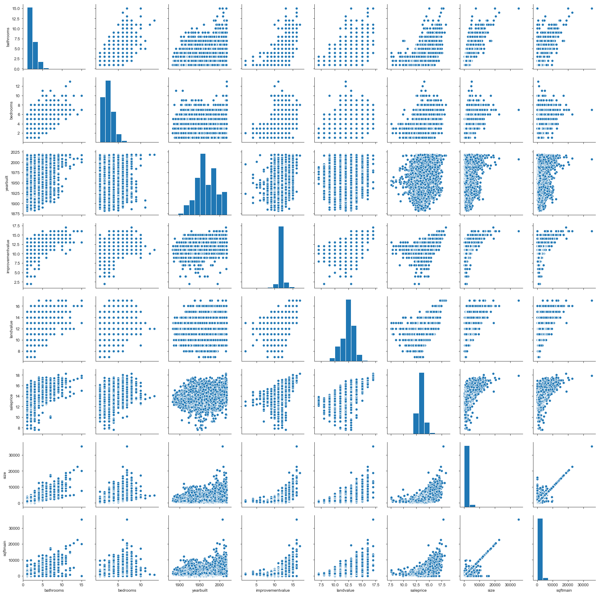
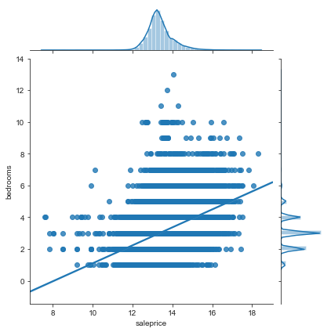
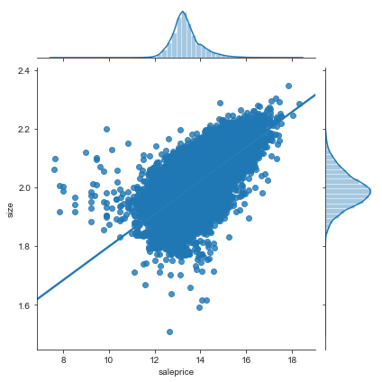
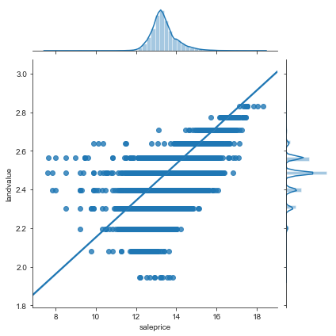
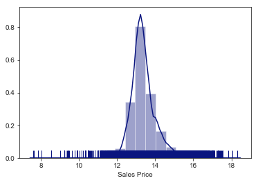
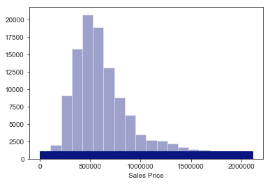

---
authors:
- matt
created_at: 2019-06-29 00:00:00
tags:
- cartoframes
- prediction
thumbnail: images/output_6_1.png
title: Los Angeles Real Estate Price Prediction Part 2
tldr: Real estate prices are something that are tied not only to the attributes of
  the property, such as the lot size, house size, and other variables, but also the
  conditions around them that exist in space.
updated_at: 2019-08-21 15:22:04.775075
---

# Los Angeles Real Estate Price Prediction

## Part 2: Explore Spatial Relationships

Real estate prices are something that are tied not only to the attributes of the property, such as the lot size, house size, and other variables, but also the conditions around them that exist in space. 
This could be demographics, nearby sales, neighborhoods, proximity to business districts, etc.

To truly understand and predict prices we need to look at the spatial variables that make up the conditions around a property. In this notebook we will explore that further using real estate sales data from 2017 to 2019 in Los Angeles County.

This data has been imported into CARTO, a spatial data science platform and PostGIS database, and will be brought into the notebook using CARTOFrames, a library that will allow us to interface with data in our CARTO account and create map visualizations. 

The data consists of two datasets, the first being historical sales data from the Los Angeles County Office of the Assessor:    

- [Property Assessment Information System Map](http://maps.assessor.lacounty.gov/GVH_2_2/Index.html?configBase=http://maps.assessor.lacounty.gov/Geocortex/Essentials/REST/sites/PAIS/viewers/PAIS_hv/virtualdirectory/Resources/Config/Default)
- [Sales Parcels](http://assessor.gis.lacounty.gov/assessor/rest/services/PAIS/pais_sales_parcels/MapServer/0)
- [All Parcels](http://assessor.gis.lacounty.gov/assessor/rest/services/PAIS/pais_parcels/MapServer/0)

And parcel information from the LA County Open Data Portal:

- [2018 Property Parcels](https://data.lacounty.gov/Parcel-/Assessor-Parcels-Data-2018/mk7y-hq5p)

Our goals for this project are:


1. To import and clean the real estate data 
2. Exploratory (spatial) data analysis
3. Limit our analysis to one category of property and explore relevant features
4. Feature engineering and tests with various machine learning models
5. Add spatial features to the data and explore spatial relationships
6. Test the model with spatial features to see the impact
7. Evaluate our model and deploy it for production usage


```python
import pandas as pd
import cartoframes
import seaborn as sns
import numpy as np
import libpysal
from cartoframes import Credentials
from cartoframes.contrib import vector

import matplotlib.pyplot as plt
%matplotlib inline

from IPython.core.pylabtools import figsize

pd.set_option('display.max_columns', 500)
sns.set_style("white")
sns.set_style("ticks")
sns.despine()


USERNAME = 'mforrest-isolines'  
APIKEY = '07ab3fb439d92c5f06cfec08bb3417d209c646d8'
creds = Credentials(username=USERNAME, key=APIKEY)

cc = cartoframes.CartoContext(creds=creds)
```


    <Figure size 432x288 with 0 Axes>


```python
sfr = cc.read('la_singlefamilyhomes')
```

```python
sfr.head(2)
```


<div>
<style scoped>
    .dataframe tbody tr th:only-of-type {
        vertical-align: middle;
    }

    .dataframe tbody tr th {
        vertical-align: top;
    }

    .dataframe thead th {
        text-align: right;
    }
</style>
<table border="1" class="dataframe">
  <thead>
    <tr style="text-align: right;">
      <th></th>
      <th>ain</th>
      <th>bathrooms</th>
      <th>bedrooms</th>
      <th>effectiveyearbuilt</th>
      <th>formatted_saledate</th>
      <th>formatted_saleprice</th>
      <th>formatted_size</th>
      <th>generalusetype</th>
      <th>impbaseyear</th>
      <th>improvementvalue</th>
      <th>landbaseyear</th>
      <th>landvalue</th>
      <th>mult_geom</th>
      <th>plot_id</th>
      <th>propertylocation</th>
      <th>propertytype</th>
      <th>propertyusecode</th>
      <th>recordingdate</th>
      <th>rollyear</th>
      <th>saaddr</th>
      <th>saaddr2</th>
      <th>safract</th>
      <th>saledate</th>
      <th>saleprice</th>
      <th>saleyear</th>
      <th>sanum</th>
      <th>sastr</th>
      <th>saunit</th>
      <th>size</th>
      <th>specificusedetail1</th>
      <th>specificusedetail2</th>
      <th>specificusetype</th>
      <th>sqftmain</th>
      <th>taxratearea</th>
      <th>taxratearea_city</th>
      <th>the_geom</th>
      <th>totbuildingdatalines</th>
      <th>units</th>
      <th>yearbuilt</th>
      <th>zipcode_p</th>
    </tr>
    <tr>
      <th>cartodb_id</th>
      <th></th>
      <th></th>
      <th></th>
      <th></th>
      <th></th>
      <th></th>
      <th></th>
      <th></th>
      <th></th>
      <th></th>
      <th></th>
      <th></th>
      <th></th>
      <th></th>
      <th></th>
      <th></th>
      <th></th>
      <th></th>
      <th></th>
      <th></th>
      <th></th>
      <th></th>
      <th></th>
      <th></th>
      <th></th>
      <th></th>
      <th></th>
      <th></th>
      <th></th>
      <th></th>
      <th></th>
      <th></th>
      <th></th>
      <th></th>
      <th></th>
      <th></th>
      <th></th>
      <th></th>
      <th></th>
      <th></th>
    </tr>
  </thead>
  <tbody>
    <tr>
      <th>112031</th>
      <td>5504028122</td>
      <td>1</td>
      <td>2</td>
      <td>1992</td>
      <td>05/21/2018</td>
      <td>$548,005</td>
      <td>979</td>
      <td>Residential</td>
      <td>2009</td>
      <td>201905</td>
      <td>2009</td>
      <td>188550</td>
      <td>1</td>
      <td>81377</td>
      <td>620 S GRAMERCY PL, 319  LOS ANGELES CA  90005</td>
      <td>CND</td>
      <td>010E</td>
      <td>20090619</td>
      <td>2018</td>
      <td>620 S GRAMERCY PL, 319</td>
      <td>LOS ANGELES CA 90005</td>
      <td></td>
      <td>2018</td>
      <td>548005</td>
      <td>2018</td>
      <td>620</td>
      <td>GRAMERCY PL</td>
      <td>319</td>
      <td>979</td>
      <td></td>
      <td>Condo Conversion</td>
      <td>Single Family Residence</td>
      <td>979</td>
      <td>6657</td>
      <td>LOS ANGELES</td>
      <td>0106000020E61000000100000001030000000100000018...</td>
      <td>1</td>
      <td>1</td>
      <td>1990</td>
      <td>90005-3271</td>
    </tr>
    <tr>
      <th>121718</th>
      <td>8464030012</td>
      <td>2</td>
      <td>3</td>
      <td>1956</td>
      <td>04/04/2018</td>
      <td>$470,004</td>
      <td>1,109</td>
      <td>Residential</td>
      <td>1975</td>
      <td>27124</td>
      <td>1975</td>
      <td>18072</td>
      <td>1</td>
      <td>133764</td>
      <td>1004 BROMLEY AVE  LA PUENTE CA  91746</td>
      <td>SFR</td>
      <td>0100</td>
      <td>20040628</td>
      <td>2018</td>
      <td>1004 BROMLEY AVE</td>
      <td>LA PUENTE CA 91746</td>
      <td></td>
      <td>2018</td>
      <td>470004</td>
      <td>2018</td>
      <td>1004</td>
      <td>BROMLEY AVE</td>
      <td></td>
      <td>1109</td>
      <td></td>
      <td></td>
      <td>Single Family Residence</td>
      <td>1109</td>
      <td>2224</td>
      <td>unincorporated</td>
      <td>0106000020E6100000010000000103000000010000000F...</td>
      <td>1</td>
      <td>1</td>
      <td>1956</td>
      <td>91746-1609</td>
    </tr>
  </tbody>
</table>
</div>


```python
sfr.columns.values
```


    array(['ain', 'bathrooms', 'bedrooms', 'effectiveyearbuilt',
           'formatted_saledate', 'formatted_saleprice', 'formatted_size',
           'generalusetype', 'impbaseyear', 'improvementvalue',
           'landbaseyear', 'landvalue', 'mult_geom', 'plot_id',
           'propertylocation', 'propertytype', 'propertyusecode',
           'recordingdate', 'rollyear', 'saaddr', 'saaddr2', 'safract',
           'saledate', 'saleprice', 'saleyear', 'sanum', 'sastr', 'saunit',
           'size', 'specificusedetail1', 'specificusedetail2',
           'specificusetype', 'sqftmain', 'taxratearea', 'taxratearea_city',
           'the_geom', 'totbuildingdatalines', 'units', 'yearbuilt',
           'zipcode_p'], dtype=object)


```python
f = sfr[['bathrooms', 'bedrooms', 'yearbuilt', 'improvementvalue', 'landvalue',
         'saleprice', 'size', 'sqftmain']]

f['yearbuilt'] = f['yearbuilt'].astype(int)

f['saleprice'] = f['saleprice'].apply(lambda x:np.log(x))
f['improvementvalue'] = f['improvementvalue'].apply(lambda x:np.log(x).astype(int))
# f = f[(f['improvementvalue'] != float('inf')) and (f['improvementvalue'] != float('-inf'))]

f['landvalue'] = f['landvalue'].apply(lambda x:np.log(x).astype(int))
# f = f[(f['landvalue'] != float('inf')) and (f['landvalue'] != float('-inf'))]
f = f[(f['yearbuilt'] > 0) & (f['bedrooms'] < 20) & (f['bathrooms'] < 20) & (f['improvementvalue'] > 0)]

# f.reset_index(drop=True, inplace=True)

pp = sns.pairplot(f)
```





# Residential Area and Sale Price


```python
sns.set_style("white")
sns.set_style("ticks")

d = f[f['bedrooms'] < 20]

g = sns.JointGrid(x="saleprice", y="bedrooms", data=d)
g = g.plot(sns.regplot, sns.distplot)
```





```python
sns.set_style("white")
sns.set_style("ticks")

f['size'] = f['size'].apply(lambda x:np.log(x))

g = sns.JointGrid(x="saleprice", y="size", data=f)
g = g.plot(sns.regplot, sns.distplot)
```





```python
sns.set_style("white")
sns.set_style("ticks")

f['landvalue'] = f['landvalue'].apply(lambda x:np.log(x))

g = sns.JointGrid(x="saleprice", y="landvalue", data=f)
g = g.plot(sns.regplot, sns.distplot)
```





# Remove additional outliers

As we saw above, we want to pull out any additional outlier data.


```python
d = pd.Series(np.log(sfr.saleprice))

ax = sns.distplot(d, bins=20, kde=True, rug=True, color="#0A157F", axlabel='Sales Price')
```





# Remove extreme outliers

Remove the most extreme outliers from the data using this function:


```python
first_quartile = sfr['saleprice'].describe()['25%']
third_quartile = sfr['saleprice'].describe()['75%']

# Interquartile range
iqr = third_quartile - first_quartile

# Remove outliers
sfr_c = sfr[(sfr['saleprice'] > (first_quartile - 3 * iqr)) &
            (sfr['saleprice'] < (third_quartile + 3 * iqr))]
```

```python
d = pd.Series(np.log(sfr_c.saleprice))
d = sfr_c.saleprice

ax = sns.distplot(d, bins=20, kde=False, rug=True, color="#0A157F", axlabel='Sales Price')
```





```python
sfr_c.sort_values(by=['saleprice'], ascending=False).head(10)
```


<div>
<style scoped>
    .dataframe tbody tr th:only-of-type {
        vertical-align: middle;
    }

    .dataframe tbody tr th {
        vertical-align: top;
    }

    .dataframe thead th {
        text-align: right;
    }
</style>
<table border="1" class="dataframe">
  <thead>
    <tr style="text-align: right;">
      <th></th>
      <th>ain</th>
      <th>bathrooms</th>
      <th>bedrooms</th>
      <th>effectiveyearbuilt</th>
      <th>formatted_saledate</th>
      <th>formatted_saleprice</th>
      <th>formatted_size</th>
      <th>generalusetype</th>
      <th>impbaseyear</th>
      <th>improvementvalue</th>
      <th>landbaseyear</th>
      <th>landvalue</th>
      <th>mult_geom</th>
      <th>plot_id</th>
      <th>propertylocation</th>
      <th>propertytype</th>
      <th>propertyusecode</th>
      <th>recordingdate</th>
      <th>rollyear</th>
      <th>saaddr</th>
      <th>saaddr2</th>
      <th>safract</th>
      <th>saledate</th>
      <th>saleprice</th>
      <th>saleyear</th>
      <th>sanum</th>
      <th>sastr</th>
      <th>saunit</th>
      <th>size</th>
      <th>specificusedetail1</th>
      <th>specificusedetail2</th>
      <th>specificusetype</th>
      <th>sqftmain</th>
      <th>taxratearea</th>
      <th>taxratearea_city</th>
      <th>the_geom</th>
      <th>totbuildingdatalines</th>
      <th>units</th>
      <th>yearbuilt</th>
      <th>zipcode_p</th>
    </tr>
    <tr>
      <th>cartodb_id</th>
      <th></th>
      <th></th>
      <th></th>
      <th></th>
      <th></th>
      <th></th>
      <th></th>
      <th></th>
      <th></th>
      <th></th>
      <th></th>
      <th></th>
      <th></th>
      <th></th>
      <th></th>
      <th></th>
      <th></th>
      <th></th>
      <th></th>
      <th></th>
      <th></th>
      <th></th>
      <th></th>
      <th></th>
      <th></th>
      <th></th>
      <th></th>
      <th></th>
      <th></th>
      <th></th>
      <th></th>
      <th></th>
      <th></th>
      <th></th>
      <th></th>
      <th></th>
      <th></th>
      <th></th>
      <th></th>
      <th></th>
    </tr>
  </thead>
  <tbody>
    <tr>
      <th>57121</th>
      <td>4366004005</td>
      <td>3</td>
      <td>3</td>
      <td>1969</td>
      <td>03/31/2017</td>
      <td>$2,109,021</td>
      <td>2,886</td>
      <td>Residential</td>
      <td>2017</td>
      <td>430236</td>
      <td>2017</td>
      <td>1720944</td>
      <td>1</td>
      <td>63186</td>
      <td>234 N GLENROY AVE  LOS ANGELES CA  90049</td>
      <td>SFR</td>
      <td>0101</td>
      <td>20170331</td>
      <td>2018</td>
      <td>234 N GLENROY AVE</td>
      <td>LOS ANGELES CA 90049</td>
      <td></td>
      <td>2017</td>
      <td>2109021</td>
      <td>2017</td>
      <td>234</td>
      <td>GLENROY AVE</td>
      <td></td>
      <td>2886</td>
      <td></td>
      <td>Pool</td>
      <td>Single Family Residence</td>
      <td>2886</td>
      <td>67</td>
      <td>LOS ANGELES</td>
      <td>0106000020E61000000100000001030000000100000008...</td>
      <td>1</td>
      <td>1</td>
      <td>1955</td>
      <td>90049-2418</td>
    </tr>
    <tr>
      <th>76378</th>
      <td>4443017010</td>
      <td>3</td>
      <td>4</td>
      <td>1972</td>
      <td>12/20/2017</td>
      <td>$2,109,021</td>
      <td>2,256</td>
      <td>Residential</td>
      <td>2018</td>
      <td>421800</td>
      <td>2018</td>
      <td>1687200</td>
      <td>1</td>
      <td>64563</td>
      <td>3429 CLOUDCROFT DR  MALIBU CA  90265</td>
      <td>SFR</td>
      <td>0100</td>
      <td>20171220</td>
      <td>2018</td>
      <td>3429 CLOUDCROFT DR</td>
      <td>MALIBU CA 90265</td>
      <td></td>
      <td>2017</td>
      <td>2109021</td>
      <td>2017</td>
      <td>3429</td>
      <td>CLOUDCROFT DR</td>
      <td></td>
      <td>2256</td>
      <td></td>
      <td></td>
      <td>Single Family Residence</td>
      <td>2256</td>
      <td>8645</td>
      <td>unincorporated</td>
      <td>0106000020E61000000100000001030000000100000006...</td>
      <td>1</td>
      <td>1</td>
      <td>1965</td>
      <td>90265-5631</td>
    </tr>
    <tr>
      <th>77528</th>
      <td>5702021007</td>
      <td>3</td>
      <td>5</td>
      <td>1929</td>
      <td>09/06/2018</td>
      <td>$2,108,021</td>
      <td>3,638</td>
      <td>Residential</td>
      <td>1975</td>
      <td>125820</td>
      <td>1975</td>
      <td>44143</td>
      <td>1</td>
      <td>88565</td>
      <td>7 RICHLAND PL  PASADENA CA  91103</td>
      <td>SFR</td>
      <td>0100</td>
      <td>19901109</td>
      <td>2018</td>
      <td>7 RICHLAND PL</td>
      <td>PASADENA CA 91103</td>
      <td></td>
      <td>2018</td>
      <td>2108021</td>
      <td>2018</td>
      <td>7</td>
      <td>RICHLAND PL</td>
      <td></td>
      <td>3638</td>
      <td></td>
      <td></td>
      <td>Single Family Residence</td>
      <td>3638</td>
      <td>7500</td>
      <td>PASADENA</td>
      <td>0106000020E61000000100000001030000000100000008...</td>
      <td>1</td>
      <td>1</td>
      <td>1929</td>
      <td>91103-2837</td>
    </tr>
    <tr>
      <th>77518</th>
      <td>5333008025</td>
      <td>5</td>
      <td>4</td>
      <td>1951</td>
      <td>09/11/2018</td>
      <td>$2,108,021</td>
      <td>2,698</td>
      <td>Residential</td>
      <td>2016</td>
      <td>472812</td>
      <td>2016</td>
      <td>1521480</td>
      <td>1</td>
      <td>76383</td>
      <td>2580 LORAIN RD  SAN MARINO CA  91108</td>
      <td>SFR</td>
      <td>0100</td>
      <td>20150818</td>
      <td>2018</td>
      <td>2580 LORAIN RD</td>
      <td>SAN MARINO CA 91108</td>
      <td></td>
      <td>2018</td>
      <td>2108021</td>
      <td>2018</td>
      <td>2580</td>
      <td>LORAIN RD</td>
      <td></td>
      <td>2698</td>
      <td></td>
      <td></td>
      <td>Single Family Residence</td>
      <td>2698</td>
      <td>8541</td>
      <td>SAN MARINO</td>
      <td>0106000020E6100000010000000103000000010000000A...</td>
      <td>1</td>
      <td>1</td>
      <td>1937</td>
      <td>91108-2907</td>
    </tr>
    <tr>
      <th>116951</th>
      <td>5587007017</td>
      <td>4</td>
      <td>4</td>
      <td>1949</td>
      <td>06/29/2018</td>
      <td>$2,107,521</td>
      <td>3,765</td>
      <td>Residential</td>
      <td>1975</td>
      <td>257284</td>
      <td>1975</td>
      <td>62890</td>
      <td>1</td>
      <td>85291</td>
      <td>5688 HOLLY OAK DR  LOS ANGELES CA  90068</td>
      <td>SFR</td>
      <td>0101</td>
      <td>19970523</td>
      <td>2018</td>
      <td>5688 HOLLY OAK DR</td>
      <td>LOS ANGELES CA 90068</td>
      <td></td>
      <td>2018</td>
      <td>2107521</td>
      <td>2018</td>
      <td>5688</td>
      <td>HOLLY OAK DR</td>
      <td></td>
      <td>3765</td>
      <td></td>
      <td>Pool</td>
      <td>Single Family Residence</td>
      <td>3765</td>
      <td>13</td>
      <td>LOS ANGELES</td>
      <td>0106000020E61000000100000001030000000100000008...</td>
      <td>1</td>
      <td>1</td>
      <td>1941</td>
      <td>90068-2522</td>
    </tr>
    <tr>
      <th>59303</th>
      <td>4174010023</td>
      <td>2</td>
      <td>3</td>
      <td>1957</td>
      <td>07/31/2018</td>
      <td>$2,107,021</td>
      <td>1,630</td>
      <td>Residential</td>
      <td>1975</td>
      <td>37459</td>
      <td>1975</td>
      <td>64189</td>
      <td>1</td>
      <td>53732</td>
      <td>617 31ST ST  MANHATTAN BEACH CA  90266</td>
      <td>SFR</td>
      <td>0100</td>
      <td>19930707</td>
      <td>2018</td>
      <td>617 31ST ST</td>
      <td>MANHATTAN BEACH CA 90266</td>
      <td></td>
      <td>2018</td>
      <td>2107021</td>
      <td>2018</td>
      <td>617</td>
      <td>31ST ST</td>
      <td></td>
      <td>1630</td>
      <td></td>
      <td></td>
      <td>Single Family Residence</td>
      <td>1630</td>
      <td>6174</td>
      <td>MANHATTAN BEACH</td>
      <td>0106000020E61000000100000001030000000100000005...</td>
      <td>1</td>
      <td>1</td>
      <td>1951</td>
      <td>90266-3419</td>
    </tr>
    <tr>
      <th>76185</th>
      <td>5713036020</td>
      <td>4</td>
      <td>6</td>
      <td>1980</td>
      <td>12/15/2017</td>
      <td>$2,106,021</td>
      <td>3,313</td>
      <td>Residential</td>
      <td>2018</td>
      <td>954800</td>
      <td>2018</td>
      <td>1151100</td>
      <td>1</td>
      <td>88862</td>
      <td>295 PALMETTO DR  PASADENA CA  91105</td>
      <td>SFR</td>
      <td>0101</td>
      <td>20171215</td>
      <td>2018</td>
      <td>295 PALMETTO DR</td>
      <td>PASADENA CA 91105</td>
      <td></td>
      <td>2017</td>
      <td>2106021</td>
      <td>2017</td>
      <td>295</td>
      <td>PALMETTO DR</td>
      <td></td>
      <td>3313</td>
      <td></td>
      <td>Pool</td>
      <td>Single Family Residence</td>
      <td>3313</td>
      <td>7500</td>
      <td>PASADENA</td>
      <td>0106000020E61000000100000001030000000100000009...</td>
      <td>1</td>
      <td>1</td>
      <td>1919</td>
      <td>91105-1813</td>
    </tr>
    <tr>
      <th>69876</th>
      <td>4262011004</td>
      <td>1</td>
      <td>2</td>
      <td>1923</td>
      <td>11/05/2018</td>
      <td>$2,105,521</td>
      <td>1,052</td>
      <td>Residential</td>
      <td>1975</td>
      <td>5360</td>
      <td>1975</td>
      <td>99739</td>
      <td>1</td>
      <td>57809</td>
      <td>1617 BARRY AVE  LOS ANGELES CA  90025</td>
      <td>SFR</td>
      <td>0100</td>
      <td>19771020</td>
      <td>2018</td>
      <td>1617 BARRY AVE</td>
      <td>LOS ANGELES CA 90025</td>
      <td></td>
      <td>2018</td>
      <td>2105521</td>
      <td>2018</td>
      <td>1617</td>
      <td>BARRY AVE</td>
      <td></td>
      <td>1052</td>
      <td></td>
      <td></td>
      <td>Single Family Residence</td>
      <td>1052</td>
      <td>67</td>
      <td>LOS ANGELES</td>
      <td>0106000020E61000000100000001030000000100000006...</td>
      <td>1</td>
      <td>1</td>
      <td>1922</td>
      <td>90025-4001</td>
    </tr>
    <tr>
      <th>116086</th>
      <td>5577021007</td>
      <td>3</td>
      <td>4</td>
      <td>1957</td>
      <td>09/21/2018</td>
      <td>$2,105,021</td>
      <td>2,319</td>
      <td>Residential</td>
      <td>1975</td>
      <td>105129</td>
      <td>1975</td>
      <td>53844</td>
      <td>1</td>
      <td>84987</td>
      <td>2950 LAKERIDGE DR  LOS ANGELES CA  90068</td>
      <td>SFR</td>
      <td>0101</td>
      <td>19840723</td>
      <td>2018</td>
      <td>2950 LAKERIDGE DR</td>
      <td>LOS ANGELES CA 90068</td>
      <td></td>
      <td>2018</td>
      <td>2105021</td>
      <td>2018</td>
      <td>2950</td>
      <td>LAKERIDGE DR</td>
      <td></td>
      <td>2319</td>
      <td></td>
      <td>Pool</td>
      <td>Single Family Residence</td>
      <td>2319</td>
      <td>13</td>
      <td>LOS ANGELES</td>
      <td>0106000020E61000000100000001030000000100000005...</td>
      <td>1</td>
      <td>1</td>
      <td>1957</td>
      <td>90068-1808</td>
    </tr>
    <tr>
      <th>73289</th>
      <td>5405003029</td>
      <td>3</td>
      <td>5</td>
      <td>1920</td>
      <td>07/27/2018</td>
      <td>$2,105,021</td>
      <td>4,908</td>
      <td>Residential</td>
      <td>2018</td>
      <td>675000</td>
      <td>2018</td>
      <td>900000</td>
      <td>1</td>
      <td>78401</td>
      <td>912 W KENSINGTON RD  LOS ANGELES CA  90026</td>
      <td>SFR</td>
      <td>0100</td>
      <td>20170726</td>
      <td>2018</td>
      <td>912 W KENSINGTON RD</td>
      <td>LOS ANGELES CA 90026</td>
      <td></td>
      <td>2018</td>
      <td>2105021</td>
      <td>2018</td>
      <td>912</td>
      <td>KENSINGTON RD</td>
      <td></td>
      <td>4908</td>
      <td></td>
      <td></td>
      <td>Single Family Residence</td>
      <td>4908</td>
      <td>13</td>
      <td>LOS ANGELES</td>
      <td>0106000020E61000000100000001030000000100000009...</td>
      <td>1</td>
      <td>1</td>
      <td>1904</td>
      <td>90026-4314</td>
    </tr>
  </tbody>
</table>
</div>


# Spatial Data Exploration and Variables

Before we run our prediction model, let's look at the spatial relationships between the different buildings across the city. 

We will use [**PySAL**](https://pysal.org/index.html) or Python Spatial Analysis Library to perform the spatial data exploration. We will identify significant clusters of high home sales using the [`esda`](https://esda.readthedocs.io/en/latest/) module from PySAL.


```python
cc.write(sfr_c, 'la_eval_clean', overwrite=True)
```
    Table successfully written to CARTO: https://mforrest-isolines.carto.com/dataset/la_eval_clean


```python
sfr_pysal = cc.read('la_eval_clean', decode_geom=True)
sfr_ps = sfr_pysal.sort_values(ascending=False, by='formatted_saledate')
sfr_ps.head(2)
```


<div>
<style scoped>
    .dataframe tbody tr th:only-of-type {
        vertical-align: middle;
    }

    .dataframe tbody tr th {
        vertical-align: top;
    }

    .dataframe thead th {
        text-align: right;
    }
</style>
<table border="1" class="dataframe">
  <thead>
    <tr style="text-align: right;">
      <th></th>
      <th>ain</th>
      <th>bathrooms</th>
      <th>bedrooms</th>
      <th>effectiveyearbuilt</th>
      <th>formatted_saledate</th>
      <th>formatted_saleprice</th>
      <th>formatted_size</th>
      <th>generalusetype</th>
      <th>impbaseyear</th>
      <th>improvementvalue</th>
      <th>landbaseyear</th>
      <th>landvalue</th>
      <th>mult_geom</th>
      <th>plot_id</th>
      <th>propertylocation</th>
      <th>propertytype</th>
      <th>propertyusecode</th>
      <th>recordingdate</th>
      <th>rollyear</th>
      <th>saaddr</th>
      <th>saaddr2</th>
      <th>safract</th>
      <th>saledate</th>
      <th>saleprice</th>
      <th>saleyear</th>
      <th>sanum</th>
      <th>sastr</th>
      <th>saunit</th>
      <th>size</th>
      <th>specificusedetail1</th>
      <th>specificusedetail2</th>
      <th>specificusetype</th>
      <th>sqftmain</th>
      <th>taxratearea</th>
      <th>taxratearea_city</th>
      <th>the_geom</th>
      <th>totbuildingdatalines</th>
      <th>units</th>
      <th>yearbuilt</th>
      <th>zipcode_p</th>
      <th>geometry</th>
    </tr>
    <tr>
      <th>cartodb_id</th>
      <th></th>
      <th></th>
      <th></th>
      <th></th>
      <th></th>
      <th></th>
      <th></th>
      <th></th>
      <th></th>
      <th></th>
      <th></th>
      <th></th>
      <th></th>
      <th></th>
      <th></th>
      <th></th>
      <th></th>
      <th></th>
      <th></th>
      <th></th>
      <th></th>
      <th></th>
      <th></th>
      <th></th>
      <th></th>
      <th></th>
      <th></th>
      <th></th>
      <th></th>
      <th></th>
      <th></th>
      <th></th>
      <th></th>
      <th></th>
      <th></th>
      <th></th>
      <th></th>
      <th></th>
      <th></th>
      <th></th>
      <th></th>
    </tr>
  </thead>
  <tbody>
    <tr>
      <th>136952</th>
      <td>8207003065</td>
      <td>2</td>
      <td>2</td>
      <td>1972</td>
      <td>12/31/2018</td>
      <td>$350,003</td>
      <td>954</td>
      <td>Residential</td>
      <td>2016</td>
      <td>150858</td>
      <td>2016</td>
      <td>176868</td>
      <td>1</td>
      <td>126513</td>
      <td>1448 COUNTRYWOOD AVE, NO 32  HACIENDA HEIGHTS ...</td>
      <td>CND</td>
      <td>010C</td>
      <td>20160629</td>
      <td>2018</td>
      <td>1448 COUNTRYWOOD AVE, NO 32</td>
      <td>HACIENDA HEIGHTS CA 91745</td>
      <td></td>
      <td>2018</td>
      <td>350003</td>
      <td>2018</td>
      <td>1448</td>
      <td>COUNTRYWOOD AVE</td>
      <td>NO 32</td>
      <td>954</td>
      <td></td>
      <td>Condominium</td>
      <td>Single Family Residence</td>
      <td>954</td>
      <td>4475</td>
      <td>unincorporated</td>
      <td>0106000020E6100000010000000103000000010000005E...</td>
      <td>1</td>
      <td>1</td>
      <td>1972</td>
      <td>91745-3056</td>
      <td>(POLYGON ((-117.9437483788245 34.0002708489307...</td>
    </tr>
    <tr>
      <th>98572</th>
      <td>6361006017</td>
      <td>3</td>
      <td>4</td>
      <td>1968</td>
      <td>12/31/2018</td>
      <td>$690,006</td>
      <td>2,126</td>
      <td>Residential</td>
      <td>2005</td>
      <td>249900</td>
      <td>2005</td>
      <td>456100</td>
      <td>1</td>
      <td>103618</td>
      <td>9305 DOWNEY AVE  DOWNEY CA  90240</td>
      <td>SFR</td>
      <td>0100</td>
      <td>20060510</td>
      <td>2018</td>
      <td>9305 DOWNEY AVE</td>
      <td>DOWNEY CA 90240</td>
      <td></td>
      <td>2018</td>
      <td>690006</td>
      <td>2018</td>
      <td>9305</td>
      <td>DOWNEY AVE</td>
      <td></td>
      <td>2126</td>
      <td></td>
      <td></td>
      <td>Single Family Residence</td>
      <td>2126</td>
      <td>3291</td>
      <td>DOWNEY</td>
      <td>0106000020E61000000100000001030000000100000007...</td>
      <td>1</td>
      <td>1</td>
      <td>1951</td>
      <td>90240-2825</td>
      <td>(POLYGON ((-118.1198810527051 33.9590943995692...</td>
    </tr>
  </tbody>
</table>
</div>


```python
sfr_ps.info()
```
    <class 'pandas.core.frame.DataFrame'>
    Int64Index: 113361 entries, 136952 to 137552
    Data columns (total 41 columns):
    ain                     113361 non-null object
    bathrooms               113361 non-null int64
    bedrooms                113361 non-null int64
    effectiveyearbuilt      113361 non-null int64
    formatted_saledate      113361 non-null object
    formatted_saleprice     113361 non-null object
    formatted_size          113361 non-null object
    generalusetype          113361 non-null object
    impbaseyear             113361 non-null int64
    improvementvalue        113361 non-null int64
    landbaseyear            113361 non-null int64
    landvalue               113361 non-null int64
    mult_geom               113361 non-null int64
    plot_id                 113361 non-null int64
    propertylocation        113361 non-null object
    propertytype            113361 non-null object
    propertyusecode         113361 non-null object
    recordingdate           113361 non-null int64
    rollyear                113361 non-null int64
    saaddr                  113361 non-null object
    saaddr2                 113361 non-null object
    safract                 113361 non-null object
    saledate                113361 non-null object
    saleprice               113361 non-null int64
    saleyear                113361 non-null int64
    sanum                   113361 non-null object
    sastr                   113361 non-null object
    saunit                  113361 non-null object
    size                    113361 non-null int64
    specificusedetail1      113361 non-null object
    specificusedetail2      113361 non-null object
    specificusetype         113361 non-null object
    sqftmain                113361 non-null int64
    taxratearea             113361 non-null int64
    taxratearea_city        113361 non-null object
    the_geom                113361 non-null object
    totbuildingdatalines    113361 non-null int64
    units                   113361 non-null int64
    yearbuilt               113361 non-null object
    zipcode_p               113361 non-null object
    geometry                113361 non-null object
    dtypes: int64(18), object(23)
    memory usage: 36.3+ MB


# Drop duplicate geometries

We need to drop duplicate geometries from the dataset for the Moran's I evaluation since that will cause an error with PySAL.


```python
sfr_ps.drop_duplicates(subset = "plot_id", inplace = True) 
sfr_ps.info()
```
    <class 'pandas.core.frame.DataFrame'>
    Int64Index: 92291 entries, 136952 to 137552
    Data columns (total 41 columns):
    ain                     92291 non-null object
    bathrooms               92291 non-null int64
    bedrooms                92291 non-null int64
    effectiveyearbuilt      92291 non-null int64
    formatted_saledate      92291 non-null object
    formatted_saleprice     92291 non-null object
    formatted_size          92291 non-null object
    generalusetype          92291 non-null object
    impbaseyear             92291 non-null int64
    improvementvalue        92291 non-null int64
    landbaseyear            92291 non-null int64
    landvalue               92291 non-null int64
    mult_geom               92291 non-null int64
    plot_id                 92291 non-null int64
    propertylocation        92291 non-null object
    propertytype            92291 non-null object
    propertyusecode         92291 non-null object
    recordingdate           92291 non-null int64
    rollyear                92291 non-null int64
    saaddr                  92291 non-null object
    saaddr2                 92291 non-null object
    safract                 92291 non-null object
    saledate                92291 non-null object
    saleprice               92291 non-null int64
    saleyear                92291 non-null int64
    sanum                   92291 non-null object
    sastr                   92291 non-null object
    saunit                  92291 non-null object
    size                    92291 non-null int64
    specificusedetail1      92291 non-null object
    specificusedetail2      92291 non-null object
    specificusetype         92291 non-null object
    sqftmain                92291 non-null int64
    taxratearea             92291 non-null int64
    taxratearea_city        92291 non-null object
    the_geom                92291 non-null object
    totbuildingdatalines    92291 non-null int64
    units                   92291 non-null int64
    yearbuilt               92291 non-null object
    zipcode_p               92291 non-null object
    geometry                92291 non-null object
    dtypes: int64(18), object(23)
    memory usage: 29.6+ MB


# Create spatial weights

First we need to evaluate the spatial relationships between all the different buildings. Since these geometries do not touch, we want to use the KNN weights from PySAL:

https://libpysal.readthedocs.io/en/latest/generated/libpysal.weights.KNN.html#libpysal.weights.KNN


```python
W = libpysal.weights.KNN.from_dataframe(sfr_ps, k=10)
W.transform = 'r'
```
# Moran's I Local

To identify the significant clusters, we will use the Moran's I Local analysis from PySAL to identify clusters of high sale prices. Spatial autocorrelation as described by the PySAL examples is:

*The concept of spatial autocorrelation relates to the combination of two types of similarity: spatial similarity and attribute similarity. Although there are many different measures of spatial autocorrelation, they all combine these two types of similarity into a summary measure.*

http://darribas.org/gds_scipy16/ipynb_md/04_esda.html
https://nbviewer.jupyter.org/github/pysal/esda/blob/master/notebooks/Spatial%20Autocorrelation%20for%20Areal%20Unit%20Data.ipynb


```python
import esda
moran = esda.Moran_Local(sfr_ps.saleprice, W, transformation = "r")
```

    ---------------------------------------------------------------------------

    ModuleNotFoundError                       Traceback (most recent call last)

    <ipython-input-20-e00e115d72ae> in <module>
    ----> 1 import esda
          2 moran = esda.Moran_Local(sfr_ps.saleprice, W, transformation = "r")


    ModuleNotFoundError: No module named 'esda'


# Moran's Quads

We will use these values to create human readable clusters from the analysis - from the PySAL docs:

**q : array**

(if permutations>0) values indicate quandrant location 1 HH, 2 LH, 3 LL, 4 HL


```python
moran.q[10:100]
```
# Similarity

From PySAL Docs:

**p_sim : array**

(if permutations>0) p-values based on permutations (one-sided) null: spatial randomness alternative: the observed Ii is further away or extreme from the median of simulated values. It is either extremely high or extremely low in the distribution of simulated Is.


```python
moran.p_sim
```
From PySAL Docs:

**p_z_sim : array**

(if permutations>0) p-values based on standard normal approximation from permutations (one-sided) for two-sided tests, these values should be multiplied by 2


```python
moran.p_z_sim
```

```python
lag = libpysal.weights.lag_spatial(W, sfr_ps.saleprice)
data = sfr_ps.saleprice
```

```python
sig = 1 * (moran.p_sim < 0.05)
HH = 1 * (sig * moran.q==1)
LL = 3 * (sig * moran.q==3)
LH = 2 * (sig * moran.q==2)
HL = 4 * (sig * moran.q==4)
spots = HH + LL + LH + HL
spots
```

```python
spot_labels = [ '0 Non-Significant', 'HH - Hot Spot', 'LH - Donut', 'LL - Cold Spot', 'HL - Diamond']
labels = [spot_labels[i] for i in spots]
```

```python
moran_to_carto = sfr_ps.assign(cl=labels, p_sim = moran.p_sim, p_z_sim = moran.p_z_sim)
moran_to_carto.head(2)
```

```python
cc.write(moran_to_carto, 'manhattan_moran', overwrite=True)
```

```python

buckets='buckets($cl,["HH - Hot Spot","HL - Diamond","LH - Donut","LL - Cold Spot"])';
colorRamp='ramp('+buckets+',[#cf597e, #e88471, #39b185, #009392])';
strokeRamp='ramp('+buckets+',[#B54E6F, #CF7765, #309671, #007A7A],#636363)';
opacityStart='opacity('+colorRamp+',1)';
opacityEnd='opacity('+colorRamp+',0.6)';

vector.vmap(
    [vector.Layer(
        'manhattan_moran',
        color='ramp(zoomrange([0,16]),['+opacityStart+','+opacityEnd+'])',
        strokeWidth='ramp(zoomrange([12,14]),[0,0.7])',
        strokeColor=strokeRamp,
        interactivity={
            'cols': ['cl','formatted_saleprice','formatted_size','generalusetype'],
            'event': 'hover'
        }
    ),],
    context=cc,
    basemap=vector.BaseMaps.voyager
)
```


<iframe srcdoc="<!DOCTYPE html>
<html lang=&quot;en&quot;>
<head>
  <title>CARTO VL + CARTOframes</title>
  <meta name=&quot;viewport&quot; content=&quot;width=device-width, initial-scale=1.0&quot;>
  <meta charset=&quot;UTF-8&quot;>
  <!-- Include CARTO VL JS -->
  <script src=&quot;https://libs.cartocdn.com/carto-vl/v1.1.1/carto-vl.min.js&quot;></script>
  <!-- Include Mapbox GL JS -->
  <script src=&quot;https://api.tiles.mapbox.com/mapbox-gl-js/v0.52.0/mapbox-gl.js&quot;></script>
  <!-- Include Mapbox GL CSS -->
  <link href=&quot;https://api.tiles.mapbox.com/mapbox-gl-js/v0.52.0/mapbox-gl.css&quot; rel=&quot;stylesheet&quot; />
  <!-- Include Airship for layouts -->
  <link href=&quot;https://libs.cartocdn.com/airship-style/v1.0.3/airship.css&quot; rel=&quot;stylesheet&quot;>
  <!-- Include airship components -->
  <script src=&quot;https://libs.cartocdn.com/airship-components/v1.0.3/airship.js&quot;></script>
  <style>
    body {
      margin: 0;
      padding: 0;
    }
    #map {
      position: absolute;
      height: 100%;
      width: 100%;
    }
  </style>
</head>
<body class=&quot;as-app-body as-app&quot;>
  <div class=&quot;as-content&quot;>
    <main class=&quot;as-main&quot;>
      <div class=&quot;as-map-area&quot;>
        <div id=&quot;map&quot;></div>
        <div class=&quot;as-map-panels&quot;>
          <div class=&quot;as-panel as-panel--right as-panel--top&quot;>
            <div class=&quot;as-panel__element&quot; id=&quot;legends&quot; style=&quot;display: none;&quot;>
            </div>
          </div> <!-- as-panel -->
        </div> <!-- as-map-panels -->
      </div> <!-- as-map-area -->
    </main> <!-- as-main -->
  </div> <!-- as-content -->

  <script>
    const BASEMAPS = {
        DarkMatter: carto.basemaps.darkmatter,
        Voyager: carto.basemaps.voyager,
        Positron: carto.basemaps.positron
    };
    if (&quot;&quot;) {
      mapboxgl.accessToken = &quot;&quot;;
    }
    // Fetch CARTO basemap if it's there, else try to use other supplied style
    const map = new mapboxgl.Map({
      container: 'map',
      style: BASEMAPS['Voyager'] || &quot;Voyager&quot;,
      zoom: 9,
      dragRotate: false
    });

    let credentials = {&quot;username&quot;: &quot;mforrest-isolines&quot;, &quot;api_key&quot;: &quot;07ab3fb439d92c5f06cfec08bb3417d209c646d8&quot;, &quot;base_url&quot;: &quot;https://mforrest-isolines.carto.com&quot;};
    carto.setDefaultAuth({
      username: credentials['username'],
      apiKey: credentials['api_key'] || 'default_public'
    });
    carto.setDefaultConfig({
        serverURL: credentials['base_url'] || `https://${credentials['user']}.carto.com/`
    });
    var sources = [{&quot;is_local&quot;: false, &quot;styling&quot;: &quot;@cl: $cl\n@formatted_saleprice: $formatted_saleprice\n@formatted_size: $formatted_size\n@generalusetype: $generalusetype\ncolor: ramp(zoomrange([0,16]),[opacity(ramp(buckets($cl,[\&quot;HH - Hot Spot\&quot;,\&quot;HL - Diamond\&quot;,\&quot;LH - Donut\&quot;,\&quot;LL - Cold Spot\&quot;]),[#cf597e, #e88471, #39b185, #009392]),1),opacity(ramp(buckets($cl,[\&quot;HH - Hot Spot\&quot;,\&quot;HL - Diamond\&quot;,\&quot;LH - Donut\&quot;,\&quot;LL - Cold Spot\&quot;]),[#cf597e, #e88471, #39b185, #009392]),0.6)])\nstrokeWidth: ramp(zoomrange([12,14]),[0,0.7])\nstrokeColor: ramp(buckets($cl,[\&quot;HH - Hot Spot\&quot;,\&quot;HL - Diamond\&quot;,\&quot;LH - Donut\&quot;,\&quot;LL - Cold Spot\&quot;]),[#B54E6F, #CF7765, #309671, #007A7A],#636363)&quot;, &quot;source&quot;: &quot;SELECT * FROM manhattan_moran&quot;, &quot;interactivity&quot;: {&quot;event&quot;: &quot;hover&quot;, &quot;header&quot;: null}, &quot;legend&quot;: null}];

    map.fitBounds([[-118.89774945283, 33.3392122299962], [-117.652304625162, 34.8199743095355]], {animate: false});

    sources.forEach((elem, idx) => {
      let temp_source = null;
      if (elem.is_local) {
        let local_json = JSON.parse(elem.source);
        temp_source = new carto.source.GeoJSON(local_json);
      } else {
        temp_source = new carto.source.SQL(elem.source);
      }
      const viz = new carto.Viz(elem['styling']);
      let temp = new carto.Layer(
          'layer' + idx,
          temp_source,
          viz
      );
      var last_source = idx === 0 ? 'watername_ocean' : 'layer' + (idx - 1);
      temp.addTo(map);

      // When layer loads, trigger legend event
      temp.on('loaded', () => {
          // Request data for legend from the layer viz
          if (viz.color.getLegendData) {
              const colorLegend = viz.color.getLegendData();
              let colorLegendList = '';

              // Create list elements for legend
              colorLegend.data.forEach((legend, index) => {
                  const color = legend.value;
                  const keyMin = legend.key[0].toFixed(2);
                  const keyMax = legend.key[1].toFixed(2);
                  let bucket = `${keyMin} - ${keyMax}`;
                  if (keyMin === '-Infinity') {
                    bucket = `< ${keyMax}`;
                  } else if (keyMax === 'Infinity') {
                    bucket = `> ${keyMin}`;
                  }
                  // Style for legend items
                  colorLegendList +=
                          `<li style=&quot;color: rgb(${color.r}, ${color.g}, ${color.b}); font-size: 300%;&quot; class=&quot;as-list__item&quot;><span style=&quot;vertical-align: middle;&quot; class=&quot;as-color--type-01 as-body as-font--medium&quot;>${bucket}</span></li>\n`;
              });

              const legend = `<section class=&quot;as-box&quot;>
                  <h1 class=&quot;as-subheader&quot;>${elem.legend || 'Layer ' + idx}</h1>
                  <div class=&quot;legend as-body&quot;>
                    <ul class=&quot;as-list&quot;>
    				${colorLegendList}
                    </ul>
                  </div>
    			</section>`;
              document.getElementById('legends').style.display = 'block';
              // Place list items in the content section of the title/legend box
              document.getElementById('legends').innerHTML += legend;
          }
      });

      if (elem.interactivity) {
        let interactivity = new carto.Interactivity(temp);
        let tempPopup = new mapboxgl.Popup({
                  closeButton: false,
                  closeOnClick: false
                });
        if (elem.interactivity.event == 'click') {
          setPopupsClick(tempPopup, interactivity, elem.interactivity.header);
        } else if (elem.interactivity.event == 'hover') {
          setPopupsHover(tempPopup, interactivity, elem.interactivity.header);
        }
      }
    });
    function setPopupsClick(tempPopup, intera, popupHeader) {
      intera.off('featureHover', (event) => {
          updatePopup(tempPopup, event, popupHeader)
      });
      intera.on('featureClick', (event) => {
          updatePopup(tempPopup, event, popupHeader, popupHeader)
      });
    }
    function setPopupsHover(tempPopup, intera, popupHeader) {
      intera.off('featureClick', (event) => {
          updatePopup(tempPopup, event, popupHeader)
      });
      intera.on('featureHover', (event) => {
          updatePopup(tempPopup, event, popupHeader)
      });
    }
    function updatePopup(layer_popup, event, popupHeader) {
      if (event.features.length > 0) {
        const vars = event.features[0].variables;
        let popupHTML = popupHeader ? `<h1>${popupHeader}</h1>` : ``;
        Object.keys(vars).forEach((varName) => {
            popupHTML += `
                <h3 class=&quot;h3&quot;>${varName}</h3>
                <p class=&quot;description open-sans&quot;>${vars[varName].value}</p>
            `;
        });
        layer_popup.setLngLat([event.coordinates.lng, event.coordinates.lat])
             .setHTML(`<div>${popupHTML}</div>`);
        if (!layer_popup.isOpen()) {
          layer_popup.addTo(map);
        }
      } else {
        layer_popup.remove();
      }
    }
   </script>
</body>
</html>
" width=1024 height=632></iframe>


# HH - Hot Spots

We can see that there are clusters of high sale price properties in the Upper East Side and the West Village


```python
qHH = '''
      SELECT * FROM manhattan_moran
      WHERE cl = 'HH - Hot Spot'
      '''

vector.vmap(
    [vector.QueryLayer(
        qHH,
        color='ramp(zoomrange([0,16]),[opacity(#cf597e,1),opacity(#cf597e,0.6)])',
        strokeWidth='ramp(zoomrange([12,14]),[0,0.7])',
        strokeColor='#B54E6F',
        interactivity={
            'cols': ['formatted_saleprice','formatted_size','generalusetype'],
            'header': ['<h2>HH - Hot Spot<h2>', ],
            'event': 'hover'
        }
    ),
    ],
    context=cc,
    basemap=vector.BaseMaps.voyager
)
```


<iframe srcdoc="<!DOCTYPE html>
<html lang=&quot;en&quot;>
<head>
  <title>CARTO VL + CARTOframes</title>
  <meta name=&quot;viewport&quot; content=&quot;width=device-width, initial-scale=1.0&quot;>
  <meta charset=&quot;UTF-8&quot;>
  <!-- Include CARTO VL JS -->
  <script src=&quot;https://libs.cartocdn.com/carto-vl/v1.1.1/carto-vl.min.js&quot;></script>
  <!-- Include Mapbox GL JS -->
  <script src=&quot;https://api.tiles.mapbox.com/mapbox-gl-js/v0.52.0/mapbox-gl.js&quot;></script>
  <!-- Include Mapbox GL CSS -->
  <link href=&quot;https://api.tiles.mapbox.com/mapbox-gl-js/v0.52.0/mapbox-gl.css&quot; rel=&quot;stylesheet&quot; />
  <!-- Include Airship for layouts -->
  <link href=&quot;https://libs.cartocdn.com/airship-style/v1.0.3/airship.css&quot; rel=&quot;stylesheet&quot;>
  <!-- Include airship components -->
  <script src=&quot;https://libs.cartocdn.com/airship-components/v1.0.3/airship.js&quot;></script>
  <style>
    body {
      margin: 0;
      padding: 0;
    }
    #map {
      position: absolute;
      height: 100%;
      width: 100%;
    }
  </style>
</head>
<body class=&quot;as-app-body as-app&quot;>
  <div class=&quot;as-content&quot;>
    <main class=&quot;as-main&quot;>
      <div class=&quot;as-map-area&quot;>
        <div id=&quot;map&quot;></div>
        <div class=&quot;as-map-panels&quot;>
          <div class=&quot;as-panel as-panel--right as-panel--top&quot;>
            <div class=&quot;as-panel__element&quot; id=&quot;legends&quot; style=&quot;display: none;&quot;>
            </div>
          </div> <!-- as-panel -->
        </div> <!-- as-map-panels -->
      </div> <!-- as-map-area -->
    </main> <!-- as-main -->
  </div> <!-- as-content -->

  <script>
    const BASEMAPS = {
        DarkMatter: carto.basemaps.darkmatter,
        Voyager: carto.basemaps.voyager,
        Positron: carto.basemaps.positron
    };
    if (&quot;&quot;) {
      mapboxgl.accessToken = &quot;&quot;;
    }
    // Fetch CARTO basemap if it's there, else try to use other supplied style
    const map = new mapboxgl.Map({
      container: 'map',
      style: BASEMAPS['Voyager'] || &quot;Voyager&quot;,
      zoom: 9,
      dragRotate: false
    });

    let credentials = {&quot;username&quot;: &quot;mforrest-isolines&quot;, &quot;api_key&quot;: &quot;07ab3fb439d92c5f06cfec08bb3417d209c646d8&quot;, &quot;base_url&quot;: &quot;https://mforrest-isolines.carto.com&quot;};
    carto.setDefaultAuth({
      username: credentials['username'],
      apiKey: credentials['api_key'] || 'default_public'
    });
    carto.setDefaultConfig({
        serverURL: credentials['base_url'] || `https://${credentials['user']}.carto.com/`
    });
    var sources = [{&quot;is_local&quot;: false, &quot;styling&quot;: &quot;@formatted_saleprice: $formatted_saleprice\n@formatted_size: $formatted_size\n@generalusetype: $generalusetype\ncolor: ramp(zoomrange([0,16]),[opacity(#cf597e,1),opacity(#cf597e,0.6)])\nstrokeWidth: ramp(zoomrange([12,14]),[0,0.7])\nstrokeColor: #B54E6F&quot;, &quot;source&quot;: &quot;\n      SELECT * FROM manhattan_moran\n      WHERE cl = 'HH - Hot Spot'\n      &quot;, &quot;interactivity&quot;: {&quot;event&quot;: &quot;hover&quot;, &quot;header&quot;: [&quot;<h2>HH - Hot Spot<h2>&quot;]}, &quot;legend&quot;: null}];

    map.fitBounds([[-118.89774945283, 33.720178480372], [-117.687262678567, 34.4787900209309]], {animate: false});

    sources.forEach((elem, idx) => {
      let temp_source = null;
      if (elem.is_local) {
        let local_json = JSON.parse(elem.source);
        temp_source = new carto.source.GeoJSON(local_json);
      } else {
        temp_source = new carto.source.SQL(elem.source);
      }
      const viz = new carto.Viz(elem['styling']);
      let temp = new carto.Layer(
          'layer' + idx,
          temp_source,
          viz
      );
      var last_source = idx === 0 ? 'watername_ocean' : 'layer' + (idx - 1);
      temp.addTo(map);

      // When layer loads, trigger legend event
      temp.on('loaded', () => {
          // Request data for legend from the layer viz
          if (viz.color.getLegendData) {
              const colorLegend = viz.color.getLegendData();
              let colorLegendList = '';

              // Create list elements for legend
              colorLegend.data.forEach((legend, index) => {
                  const color = legend.value;
                  const keyMin = legend.key[0].toFixed(2);
                  const keyMax = legend.key[1].toFixed(2);
                  let bucket = `${keyMin} - ${keyMax}`;
                  if (keyMin === '-Infinity') {
                    bucket = `< ${keyMax}`;
                  } else if (keyMax === 'Infinity') {
                    bucket = `> ${keyMin}`;
                  }
                  // Style for legend items
                  colorLegendList +=
                          `<li style=&quot;color: rgb(${color.r}, ${color.g}, ${color.b}); font-size: 300%;&quot; class=&quot;as-list__item&quot;><span style=&quot;vertical-align: middle;&quot; class=&quot;as-color--type-01 as-body as-font--medium&quot;>${bucket}</span></li>\n`;
              });

              const legend = `<section class=&quot;as-box&quot;>
                  <h1 class=&quot;as-subheader&quot;>${elem.legend || 'Layer ' + idx}</h1>
                  <div class=&quot;legend as-body&quot;>
                    <ul class=&quot;as-list&quot;>
    				${colorLegendList}
                    </ul>
                  </div>
    			</section>`;
              document.getElementById('legends').style.display = 'block';
              // Place list items in the content section of the title/legend box
              document.getElementById('legends').innerHTML += legend;
          }
      });

      if (elem.interactivity) {
        let interactivity = new carto.Interactivity(temp);
        let tempPopup = new mapboxgl.Popup({
                  closeButton: false,
                  closeOnClick: false
                });
        if (elem.interactivity.event == 'click') {
          setPopupsClick(tempPopup, interactivity, elem.interactivity.header);
        } else if (elem.interactivity.event == 'hover') {
          setPopupsHover(tempPopup, interactivity, elem.interactivity.header);
        }
      }
    });
    function setPopupsClick(tempPopup, intera, popupHeader) {
      intera.off('featureHover', (event) => {
          updatePopup(tempPopup, event, popupHeader)
      });
      intera.on('featureClick', (event) => {
          updatePopup(tempPopup, event, popupHeader, popupHeader)
      });
    }
    function setPopupsHover(tempPopup, intera, popupHeader) {
      intera.off('featureClick', (event) => {
          updatePopup(tempPopup, event, popupHeader)
      });
      intera.on('featureHover', (event) => {
          updatePopup(tempPopup, event, popupHeader)
      });
    }
    function updatePopup(layer_popup, event, popupHeader) {
      if (event.features.length > 0) {
        const vars = event.features[0].variables;
        let popupHTML = popupHeader ? `<h1>${popupHeader}</h1>` : ``;
        Object.keys(vars).forEach((varName) => {
            popupHTML += `
                <h3 class=&quot;h3&quot;>${varName}</h3>
                <p class=&quot;description open-sans&quot;>${vars[varName].value}</p>
            `;
        });
        layer_popup.setLngLat([event.coordinates.lng, event.coordinates.lat])
             .setHTML(`<div>${popupHTML}</div>`);
        if (!layer_popup.isOpen()) {
          layer_popup.addTo(map);
        }
      } else {
        layer_popup.remove();
      }
    }
   </script>
</body>
</html>
" width=1024 height=632></iframe>


# LL - Cold Spots

Upper Manhattan contains large clusters of low sale price properties


```python
qLL = '''
      SELECT * FROM manhattan_moran
      WHERE cl = 'LL - Cold Spot'
      '''

vector.vmap(
    [vector.QueryLayer(
        qLL,
        color='ramp(zoomrange([0,16]),[opacity(#009392,1),opacity(#009392,0.6)])',
        strokeWidth='ramp(zoomrange([12,14]),[0,0.7])',
        strokeColor='#007A7A',
        interactivity={
            'cols': ['formatted_saleprice','formatted_size','generalusetype'],
            'header': ['<h2>LL - Cold Spot<h2>', ],
            'event': 'hover'
        }
    ),],
    context=cc,
    basemap=vector.BaseMaps.voyager
)
```


<iframe srcdoc="<!DOCTYPE html>
<html lang=&quot;en&quot;>
<head>
  <title>CARTO VL + CARTOframes</title>
  <meta name=&quot;viewport&quot; content=&quot;width=device-width, initial-scale=1.0&quot;>
  <meta charset=&quot;UTF-8&quot;>
  <!-- Include CARTO VL JS -->
  <script src=&quot;https://libs.cartocdn.com/carto-vl/v1.1.1/carto-vl.min.js&quot;></script>
  <!-- Include Mapbox GL JS -->
  <script src=&quot;https://api.tiles.mapbox.com/mapbox-gl-js/v0.52.0/mapbox-gl.js&quot;></script>
  <!-- Include Mapbox GL CSS -->
  <link href=&quot;https://api.tiles.mapbox.com/mapbox-gl-js/v0.52.0/mapbox-gl.css&quot; rel=&quot;stylesheet&quot; />
  <!-- Include Airship for layouts -->
  <link href=&quot;https://libs.cartocdn.com/airship-style/v1.0.3/airship.css&quot; rel=&quot;stylesheet&quot;>
  <!-- Include airship components -->
  <script src=&quot;https://libs.cartocdn.com/airship-components/v1.0.3/airship.js&quot;></script>
  <style>
    body {
      margin: 0;
      padding: 0;
    }
    #map {
      position: absolute;
      height: 100%;
      width: 100%;
    }
  </style>
</head>
<body class=&quot;as-app-body as-app&quot;>
  <div class=&quot;as-content&quot;>
    <main class=&quot;as-main&quot;>
      <div class=&quot;as-map-area&quot;>
        <div id=&quot;map&quot;></div>
        <div class=&quot;as-map-panels&quot;>
          <div class=&quot;as-panel as-panel--right as-panel--top&quot;>
            <div class=&quot;as-panel__element&quot; id=&quot;legends&quot; style=&quot;display: none;&quot;>
            </div>
          </div> <!-- as-panel -->
        </div> <!-- as-map-panels -->
      </div> <!-- as-map-area -->
    </main> <!-- as-main -->
  </div> <!-- as-content -->

  <script>
    const BASEMAPS = {
        DarkMatter: carto.basemaps.darkmatter,
        Voyager: carto.basemaps.voyager,
        Positron: carto.basemaps.positron
    };
    if (&quot;&quot;) {
      mapboxgl.accessToken = &quot;&quot;;
    }
    // Fetch CARTO basemap if it's there, else try to use other supplied style
    const map = new mapboxgl.Map({
      container: 'map',
      style: BASEMAPS['Voyager'] || &quot;Voyager&quot;,
      zoom: 9,
      dragRotate: false
    });

    let credentials = {&quot;username&quot;: &quot;mforrest-isolines&quot;, &quot;api_key&quot;: &quot;07ab3fb439d92c5f06cfec08bb3417d209c646d8&quot;, &quot;base_url&quot;: &quot;https://mforrest-isolines.carto.com&quot;};
    carto.setDefaultAuth({
      username: credentials['username'],
      apiKey: credentials['api_key'] || 'default_public'
    });
    carto.setDefaultConfig({
        serverURL: credentials['base_url'] || `https://${credentials['user']}.carto.com/`
    });
    var sources = [{&quot;is_local&quot;: false, &quot;styling&quot;: &quot;@formatted_saleprice: $formatted_saleprice\n@formatted_size: $formatted_size\n@generalusetype: $generalusetype\ncolor: ramp(zoomrange([0,16]),[opacity(#009392,1),opacity(#009392,0.6)])\nstrokeWidth: ramp(zoomrange([12,14]),[0,0.7])\nstrokeColor: #007A7A&quot;, &quot;source&quot;: &quot;\n      SELECT * FROM manhattan_moran\n      WHERE cl = 'LL - Cold Spot'\n      &quot;, &quot;interactivity&quot;: {&quot;event&quot;: &quot;hover&quot;, &quot;header&quot;: [&quot;<h2>LL - Cold Spot<h2>&quot;]}, &quot;legend&quot;: null}];

    map.fitBounds([[-118.801500714528, 33.7160756714608], [-117.652304625162, 34.8199743095355]], {animate: false});

    sources.forEach((elem, idx) => {
      let temp_source = null;
      if (elem.is_local) {
        let local_json = JSON.parse(elem.source);
        temp_source = new carto.source.GeoJSON(local_json);
      } else {
        temp_source = new carto.source.SQL(elem.source);
      }
      const viz = new carto.Viz(elem['styling']);
      let temp = new carto.Layer(
          'layer' + idx,
          temp_source,
          viz
      );
      var last_source = idx === 0 ? 'watername_ocean' : 'layer' + (idx - 1);
      temp.addTo(map);

      // When layer loads, trigger legend event
      temp.on('loaded', () => {
          // Request data for legend from the layer viz
          if (viz.color.getLegendData) {
              const colorLegend = viz.color.getLegendData();
              let colorLegendList = '';

              // Create list elements for legend
              colorLegend.data.forEach((legend, index) => {
                  const color = legend.value;
                  const keyMin = legend.key[0].toFixed(2);
                  const keyMax = legend.key[1].toFixed(2);
                  let bucket = `${keyMin} - ${keyMax}`;
                  if (keyMin === '-Infinity') {
                    bucket = `< ${keyMax}`;
                  } else if (keyMax === 'Infinity') {
                    bucket = `> ${keyMin}`;
                  }
                  // Style for legend items
                  colorLegendList +=
                          `<li style=&quot;color: rgb(${color.r}, ${color.g}, ${color.b}); font-size: 300%;&quot; class=&quot;as-list__item&quot;><span style=&quot;vertical-align: middle;&quot; class=&quot;as-color--type-01 as-body as-font--medium&quot;>${bucket}</span></li>\n`;
              });

              const legend = `<section class=&quot;as-box&quot;>
                  <h1 class=&quot;as-subheader&quot;>${elem.legend || 'Layer ' + idx}</h1>
                  <div class=&quot;legend as-body&quot;>
                    <ul class=&quot;as-list&quot;>
    				${colorLegendList}
                    </ul>
                  </div>
    			</section>`;
              document.getElementById('legends').style.display = 'block';
              // Place list items in the content section of the title/legend box
              document.getElementById('legends').innerHTML += legend;
          }
      });

      if (elem.interactivity) {
        let interactivity = new carto.Interactivity(temp);
        let tempPopup = new mapboxgl.Popup({
                  closeButton: false,
                  closeOnClick: false
                });
        if (elem.interactivity.event == 'click') {
          setPopupsClick(tempPopup, interactivity, elem.interactivity.header);
        } else if (elem.interactivity.event == 'hover') {
          setPopupsHover(tempPopup, interactivity, elem.interactivity.header);
        }
      }
    });
    function setPopupsClick(tempPopup, intera, popupHeader) {
      intera.off('featureHover', (event) => {
          updatePopup(tempPopup, event, popupHeader)
      });
      intera.on('featureClick', (event) => {
          updatePopup(tempPopup, event, popupHeader, popupHeader)
      });
    }
    function setPopupsHover(tempPopup, intera, popupHeader) {
      intera.off('featureClick', (event) => {
          updatePopup(tempPopup, event, popupHeader)
      });
      intera.on('featureHover', (event) => {
          updatePopup(tempPopup, event, popupHeader)
      });
    }
    function updatePopup(layer_popup, event, popupHeader) {
      if (event.features.length > 0) {
        const vars = event.features[0].variables;
        let popupHTML = popupHeader ? `<h1>${popupHeader}</h1>` : ``;
        Object.keys(vars).forEach((varName) => {
            popupHTML += `
                <h3 class=&quot;h3&quot;>${varName}</h3>
                <p class=&quot;description open-sans&quot;>${vars[varName].value}</p>
            `;
        });
        layer_popup.setLngLat([event.coordinates.lng, event.coordinates.lat])
             .setHTML(`<div>${popupHTML}</div>`);
        if (!layer_popup.isOpen()) {
          layer_popup.addTo(map);
        }
      } else {
        layer_popup.remove();
      }
    }
   </script>
</body>
</html>
" width=1024 height=632></iframe>


# HL - Diamond

Properties of high sale price near low sale price properties are also concentrated in LA


```python
qHL = '''
      SELECT * FROM manhattan_moran
      WHERE cl = 'HL - Diamond'
      '''

vector.vmap(
    [vector.QueryLayer(
        qHL,
        color='ramp(zoomrange([0,16]),[opacity(#e88471,1),opacity(#e88471,0.6)])',
        strokeWidth='ramp(zoomrange([12,14]),[0,0.7])',
        strokeColor='#CF7765',
        interactivity={
            'cols': ['formatted_saleprice','formatted_size','generalusetype'],
            'header': ['<h2>HL - Diamond<h2>', ],
            'event': 'hover'
        }
    ),],
    context=cc,
    basemap=vector.BaseMaps.voyager
)
```


<iframe srcdoc="<!DOCTYPE html>
<html lang=&quot;en&quot;>
<head>
  <title>CARTO VL + CARTOframes</title>
  <meta name=&quot;viewport&quot; content=&quot;width=device-width, initial-scale=1.0&quot;>
  <meta charset=&quot;UTF-8&quot;>
  <!-- Include CARTO VL JS -->
  <script src=&quot;https://libs.cartocdn.com/carto-vl/v1.1.1/carto-vl.min.js&quot;></script>
  <!-- Include Mapbox GL JS -->
  <script src=&quot;https://api.tiles.mapbox.com/mapbox-gl-js/v0.52.0/mapbox-gl.js&quot;></script>
  <!-- Include Mapbox GL CSS -->
  <link href=&quot;https://api.tiles.mapbox.com/mapbox-gl-js/v0.52.0/mapbox-gl.css&quot; rel=&quot;stylesheet&quot; />
  <!-- Include Airship for layouts -->
  <link href=&quot;https://libs.cartocdn.com/airship-style/v1.0.3/airship.css&quot; rel=&quot;stylesheet&quot;>
  <!-- Include airship components -->
  <script src=&quot;https://libs.cartocdn.com/airship-components/v1.0.3/airship.js&quot;></script>
  <style>
    body {
      margin: 0;
      padding: 0;
    }
    #map {
      position: absolute;
      height: 100%;
      width: 100%;
    }
  </style>
</head>
<body class=&quot;as-app-body as-app&quot;>
  <div class=&quot;as-content&quot;>
    <main class=&quot;as-main&quot;>
      <div class=&quot;as-map-area&quot;>
        <div id=&quot;map&quot;></div>
        <div class=&quot;as-map-panels&quot;>
          <div class=&quot;as-panel as-panel--right as-panel--top&quot;>
            <div class=&quot;as-panel__element&quot; id=&quot;legends&quot; style=&quot;display: none;&quot;>
            </div>
          </div> <!-- as-panel -->
        </div> <!-- as-map-panels -->
      </div> <!-- as-map-area -->
    </main> <!-- as-main -->
  </div> <!-- as-content -->

  <script>
    const BASEMAPS = {
        DarkMatter: carto.basemaps.darkmatter,
        Voyager: carto.basemaps.voyager,
        Positron: carto.basemaps.positron
    };
    if (&quot;&quot;) {
      mapboxgl.accessToken = &quot;&quot;;
    }
    // Fetch CARTO basemap if it's there, else try to use other supplied style
    const map = new mapboxgl.Map({
      container: 'map',
      style: BASEMAPS['Voyager'] || &quot;Voyager&quot;,
      zoom: 9,
      dragRotate: false
    });

    let credentials = {&quot;username&quot;: &quot;mforrest-isolines&quot;, &quot;api_key&quot;: &quot;07ab3fb439d92c5f06cfec08bb3417d209c646d8&quot;, &quot;base_url&quot;: &quot;https://mforrest-isolines.carto.com&quot;};
    carto.setDefaultAuth({
      username: credentials['username'],
      apiKey: credentials['api_key'] || 'default_public'
    });
    carto.setDefaultConfig({
        serverURL: credentials['base_url'] || `https://${credentials['user']}.carto.com/`
    });
    var sources = [{&quot;is_local&quot;: false, &quot;styling&quot;: &quot;@formatted_saleprice: $formatted_saleprice\n@formatted_size: $formatted_size\n@generalusetype: $generalusetype\ncolor: ramp(zoomrange([0,16]),[opacity(#e88471,1),opacity(#e88471,0.6)])\nstrokeWidth: ramp(zoomrange([12,14]),[0,0.7])\nstrokeColor: #CF7765&quot;, &quot;source&quot;: &quot;\n      SELECT * FROM manhattan_moran\n      WHERE cl = 'HL - Diamond'\n      &quot;, &quot;interactivity&quot;: {&quot;event&quot;: &quot;hover&quot;, &quot;header&quot;: [&quot;<h2>HL - Diamond<h2>&quot;]}, &quot;legend&quot;: null}];

    map.fitBounds([[-118.632093744814, 33.7289901486394], [-117.702789806699, 34.6737112654144]], {animate: false});

    sources.forEach((elem, idx) => {
      let temp_source = null;
      if (elem.is_local) {
        let local_json = JSON.parse(elem.source);
        temp_source = new carto.source.GeoJSON(local_json);
      } else {
        temp_source = new carto.source.SQL(elem.source);
      }
      const viz = new carto.Viz(elem['styling']);
      let temp = new carto.Layer(
          'layer' + idx,
          temp_source,
          viz
      );
      var last_source = idx === 0 ? 'watername_ocean' : 'layer' + (idx - 1);
      temp.addTo(map);

      // When layer loads, trigger legend event
      temp.on('loaded', () => {
          // Request data for legend from the layer viz
          if (viz.color.getLegendData) {
              const colorLegend = viz.color.getLegendData();
              let colorLegendList = '';

              // Create list elements for legend
              colorLegend.data.forEach((legend, index) => {
                  const color = legend.value;
                  const keyMin = legend.key[0].toFixed(2);
                  const keyMax = legend.key[1].toFixed(2);
                  let bucket = `${keyMin} - ${keyMax}`;
                  if (keyMin === '-Infinity') {
                    bucket = `< ${keyMax}`;
                  } else if (keyMax === 'Infinity') {
                    bucket = `> ${keyMin}`;
                  }
                  // Style for legend items
                  colorLegendList +=
                          `<li style=&quot;color: rgb(${color.r}, ${color.g}, ${color.b}); font-size: 300%;&quot; class=&quot;as-list__item&quot;><span style=&quot;vertical-align: middle;&quot; class=&quot;as-color--type-01 as-body as-font--medium&quot;>${bucket}</span></li>\n`;
              });

              const legend = `<section class=&quot;as-box&quot;>
                  <h1 class=&quot;as-subheader&quot;>${elem.legend || 'Layer ' + idx}</h1>
                  <div class=&quot;legend as-body&quot;>
                    <ul class=&quot;as-list&quot;>
    				${colorLegendList}
                    </ul>
                  </div>
    			</section>`;
              document.getElementById('legends').style.display = 'block';
              // Place list items in the content section of the title/legend box
              document.getElementById('legends').innerHTML += legend;
          }
      });

      if (elem.interactivity) {
        let interactivity = new carto.Interactivity(temp);
        let tempPopup = new mapboxgl.Popup({
                  closeButton: false,
                  closeOnClick: false
                });
        if (elem.interactivity.event == 'click') {
          setPopupsClick(tempPopup, interactivity, elem.interactivity.header);
        } else if (elem.interactivity.event == 'hover') {
          setPopupsHover(tempPopup, interactivity, elem.interactivity.header);
        }
      }
    });
    function setPopupsClick(tempPopup, intera, popupHeader) {
      intera.off('featureHover', (event) => {
          updatePopup(tempPopup, event, popupHeader)
      });
      intera.on('featureClick', (event) => {
          updatePopup(tempPopup, event, popupHeader, popupHeader)
      });
    }
    function setPopupsHover(tempPopup, intera, popupHeader) {
      intera.off('featureClick', (event) => {
          updatePopup(tempPopup, event, popupHeader)
      });
      intera.on('featureHover', (event) => {
          updatePopup(tempPopup, event, popupHeader)
      });
    }
    function updatePopup(layer_popup, event, popupHeader) {
      if (event.features.length > 0) {
        const vars = event.features[0].variables;
        let popupHTML = popupHeader ? `<h1>${popupHeader}</h1>` : ``;
        Object.keys(vars).forEach((varName) => {
            popupHTML += `
                <h3 class=&quot;h3&quot;>${varName}</h3>
                <p class=&quot;description open-sans&quot;>${vars[varName].value}</p>
            `;
        });
        layer_popup.setLngLat([event.coordinates.lng, event.coordinates.lat])
             .setHTML(`<div>${popupHTML}</div>`);
        if (!layer_popup.isOpen()) {
          layer_popup.addTo(map);
        }
      } else {
        layer_popup.remove();
      }
    }
   </script>
</body>
</html>
" width=1024 height=632></iframe>


# LH - Donut

Low sale price properties near high sale price properties are scattered across the city


```python
qLH = '''
      SELECT * FROM manhattan_moran
      WHERE cl = 'LH - Donut'
      '''

colorRamp='ramp('+buckets+',[#cf597e, #e88471, #39b185, #009392])';
strokeRamp='ramp('+buckets+',[#B54E6F, #CF7765, #309671, #007A7A],#636363)';


vector.vmap(
    [vector.QueryLayer(
        qLH,
        color='ramp(zoomrange([0,16]),[opacity(#39b185,1),opacity(#39b185,0.6)])',
        strokeWidth='ramp(zoomrange([12,14]),[0,0.7])',
        strokeColor='#309671',
        interactivity={
            'cols': ['formatted_saleprice','formatted_size','generalusetype'],
            'header': ['<h2>LH - Donut<h2>', ],
            'event': 'hover'
        }
    ),],
    context=cc,
    basemap=vector.BaseMaps.voyager
)
```


<iframe srcdoc="<!DOCTYPE html>
<html lang=&quot;en&quot;>
<head>
  <title>CARTO VL + CARTOframes</title>
  <meta name=&quot;viewport&quot; content=&quot;width=device-width, initial-scale=1.0&quot;>
  <meta charset=&quot;UTF-8&quot;>
  <!-- Include CARTO VL JS -->
  <script src=&quot;https://libs.cartocdn.com/carto-vl/v1.1.1/carto-vl.min.js&quot;></script>
  <!-- Include Mapbox GL JS -->
  <script src=&quot;https://api.tiles.mapbox.com/mapbox-gl-js/v0.52.0/mapbox-gl.js&quot;></script>
  <!-- Include Mapbox GL CSS -->
  <link href=&quot;https://api.tiles.mapbox.com/mapbox-gl-js/v0.52.0/mapbox-gl.css&quot; rel=&quot;stylesheet&quot; />
  <!-- Include Airship for layouts -->
  <link href=&quot;https://libs.cartocdn.com/airship-style/v1.0.3/airship.css&quot; rel=&quot;stylesheet&quot;>
  <!-- Include airship components -->
  <script src=&quot;https://libs.cartocdn.com/airship-components/v1.0.3/airship.js&quot;></script>
  <style>
    body {
      margin: 0;
      padding: 0;
    }
    #map {
      position: absolute;
      height: 100%;
      width: 100%;
    }
  </style>
</head>
<body class=&quot;as-app-body as-app&quot;>
  <div class=&quot;as-content&quot;>
    <main class=&quot;as-main&quot;>
      <div class=&quot;as-map-area&quot;>
        <div id=&quot;map&quot;></div>
        <div class=&quot;as-map-panels&quot;>
          <div class=&quot;as-panel as-panel--right as-panel--top&quot;>
            <div class=&quot;as-panel__element&quot; id=&quot;legends&quot; style=&quot;display: none;&quot;>
            </div>
          </div> <!-- as-panel -->
        </div> <!-- as-map-panels -->
      </div> <!-- as-map-area -->
    </main> <!-- as-main -->
  </div> <!-- as-content -->

  <script>
    const BASEMAPS = {
        DarkMatter: carto.basemaps.darkmatter,
        Voyager: carto.basemaps.voyager,
        Positron: carto.basemaps.positron
    };
    if (&quot;&quot;) {
      mapboxgl.accessToken = &quot;&quot;;
    }
    // Fetch CARTO basemap if it's there, else try to use other supplied style
    const map = new mapboxgl.Map({
      container: 'map',
      style: BASEMAPS['Voyager'] || &quot;Voyager&quot;,
      zoom: 9,
      dragRotate: false
    });

    let credentials = {&quot;username&quot;: &quot;mforrest-isolines&quot;, &quot;api_key&quot;: &quot;07ab3fb439d92c5f06cfec08bb3417d209c646d8&quot;, &quot;base_url&quot;: &quot;https://mforrest-isolines.carto.com&quot;};
    carto.setDefaultAuth({
      username: credentials['username'],
      apiKey: credentials['api_key'] || 'default_public'
    });
    carto.setDefaultConfig({
        serverURL: credentials['base_url'] || `https://${credentials['user']}.carto.com/`
    });
    var sources = [{&quot;is_local&quot;: false, &quot;styling&quot;: &quot;@formatted_saleprice: $formatted_saleprice\n@formatted_size: $formatted_size\n@generalusetype: $generalusetype\ncolor: ramp(zoomrange([0,16]),[opacity(#39b185,1),opacity(#39b185,0.6)])\nstrokeWidth: ramp(zoomrange([12,14]),[0,0.7])\nstrokeColor: #309671&quot;, &quot;source&quot;: &quot;\n      SELECT * FROM manhattan_moran\n      WHERE cl = 'LH - Donut'\n      &quot;, &quot;interactivity&quot;: {&quot;event&quot;: &quot;hover&quot;, &quot;header&quot;: [&quot;<h2>LH - Donut<h2>&quot;]}, &quot;legend&quot;: null}];

    map.fitBounds([[-118.829324152068, 33.7213598987151], [-117.658724420657, 34.4798821784043]], {animate: false});

    sources.forEach((elem, idx) => {
      let temp_source = null;
      if (elem.is_local) {
        let local_json = JSON.parse(elem.source);
        temp_source = new carto.source.GeoJSON(local_json);
      } else {
        temp_source = new carto.source.SQL(elem.source);
      }
      const viz = new carto.Viz(elem['styling']);
      let temp = new carto.Layer(
          'layer' + idx,
          temp_source,
          viz
      );
      var last_source = idx === 0 ? 'watername_ocean' : 'layer' + (idx - 1);
      temp.addTo(map);

      // When layer loads, trigger legend event
      temp.on('loaded', () => {
          // Request data for legend from the layer viz
          if (viz.color.getLegendData) {
              const colorLegend = viz.color.getLegendData();
              let colorLegendList = '';

              // Create list elements for legend
              colorLegend.data.forEach((legend, index) => {
                  const color = legend.value;
                  const keyMin = legend.key[0].toFixed(2);
                  const keyMax = legend.key[1].toFixed(2);
                  let bucket = `${keyMin} - ${keyMax}`;
                  if (keyMin === '-Infinity') {
                    bucket = `< ${keyMax}`;
                  } else if (keyMax === 'Infinity') {
                    bucket = `> ${keyMin}`;
                  }
                  // Style for legend items
                  colorLegendList +=
                          `<li style=&quot;color: rgb(${color.r}, ${color.g}, ${color.b}); font-size: 300%;&quot; class=&quot;as-list__item&quot;><span style=&quot;vertical-align: middle;&quot; class=&quot;as-color--type-01 as-body as-font--medium&quot;>${bucket}</span></li>\n`;
              });

              const legend = `<section class=&quot;as-box&quot;>
                  <h1 class=&quot;as-subheader&quot;>${elem.legend || 'Layer ' + idx}</h1>
                  <div class=&quot;legend as-body&quot;>
                    <ul class=&quot;as-list&quot;>
    				${colorLegendList}
                    </ul>
                  </div>
    			</section>`;
              document.getElementById('legends').style.display = 'block';
              // Place list items in the content section of the title/legend box
              document.getElementById('legends').innerHTML += legend;
          }
      });

      if (elem.interactivity) {
        let interactivity = new carto.Interactivity(temp);
        let tempPopup = new mapboxgl.Popup({
                  closeButton: false,
                  closeOnClick: false
                });
        if (elem.interactivity.event == 'click') {
          setPopupsClick(tempPopup, interactivity, elem.interactivity.header);
        } else if (elem.interactivity.event == 'hover') {
          setPopupsHover(tempPopup, interactivity, elem.interactivity.header);
        }
      }
    });
    function setPopupsClick(tempPopup, intera, popupHeader) {
      intera.off('featureHover', (event) => {
          updatePopup(tempPopup, event, popupHeader)
      });
      intera.on('featureClick', (event) => {
          updatePopup(tempPopup, event, popupHeader, popupHeader)
      });
    }
    function setPopupsHover(tempPopup, intera, popupHeader) {
      intera.off('featureClick', (event) => {
          updatePopup(tempPopup, event, popupHeader)
      });
      intera.on('featureHover', (event) => {
          updatePopup(tempPopup, event, popupHeader)
      });
    }
    function updatePopup(layer_popup, event, popupHeader) {
      if (event.features.length > 0) {
        const vars = event.features[0].variables;
        let popupHTML = popupHeader ? `<h1>${popupHeader}</h1>` : ``;
        Object.keys(vars).forEach((varName) => {
            popupHTML += `
                <h3 class=&quot;h3&quot;>${varName}</h3>
                <p class=&quot;description open-sans&quot;>${vars[varName].value}</p>
            `;
        });
        layer_popup.setLngLat([event.coordinates.lng, event.coordinates.lat])
             .setHTML(`<div>${popupHTML}</div>`);
        if (!layer_popup.isOpen()) {
          layer_popup.addTo(map);
        }
      } else {
        layer_popup.remove();
      }
    }
   </script>
</body>
</html>
" width=1024 height=632></iframe>


```python

```