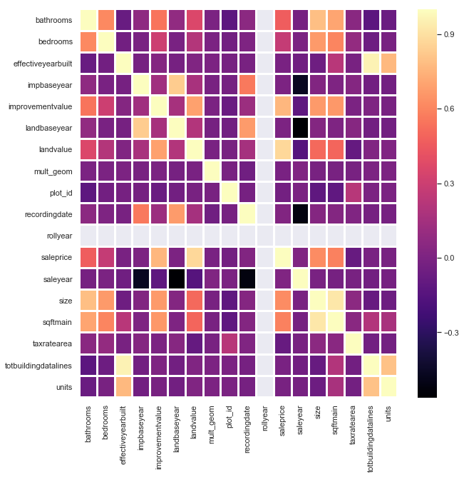
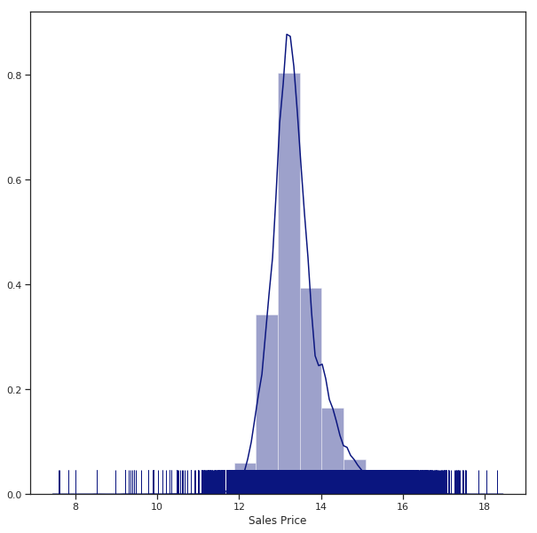

---
authors:
- matt
created_at: 2019-06-29 00:00:00
tags:
- cartoframes
- prediction
thumbnail: images/output_21_1.png
title: Los Angeles Real Estate Price Prediction Part 1
tldr: Real estate prices are something that are tied not only to the attributes of
  the property, such as the lot size, house size, and other variables, but also the
  conditions around them that exist in space.
updated_at: 2019-08-21 15:22:55.906128
---

# Los Angeles Real Estate Price Prediction

## Part 1: Data Cleaning

Real estate prices are something that are tied not only to the attributes of the property, such as the lot size, house size, and other variables, but also the conditions around them that exist in space. 
This could be demographics, nearby sales, neighborhoods, proximity to business districts, etc.

To truly understand and predict prices we need to look at the spatial variables that make up the conditions around a property. In this notebook we will explore that further using real estate sales data from 2017 to 2019 in Los Angeles County.

This data has been imported into CARTO, a spatial data science platform and PostGIS database, and will be brought into the notebook using CARTOFrames, a library that will allow us to interface with data in our CARTO account and create map visualizations. 

The data consists of two datasets, the first being historical sales data from the Los Angeles County Office of the Assessor:    

- [Property Assessment Information System Map](http://maps.assessor.lacounty.gov/GVH_2_2/Index.html?configBase=http://maps.assessor.lacounty.gov/Geocortex/Essentials/REST/sites/PAIS/viewers/PAIS_hv/virtualdirectory/Resources/Config/Default)
- [Sales Parcels](http://assessor.gis.lacounty.gov/assessor/rest/services/PAIS/pais_sales_parcels/MapServer/0)
- [All Parcels](http://assessor.gis.lacounty.gov/assessor/rest/services/PAIS/pais_parcels/MapServer/0)

And parcel information from the LA County Open Data Portal:

- [2018 Property Parcels](https://data.lacounty.gov/Parcel-/Assessor-Parcels-Data-2018/mk7y-hq5p)

Our goals for this project are:


1. To import and clean the real estate data 
2. Exploratory (spatial) data analysis
3. Limit our analysis to one category of property and explore relevant features
4. Feature engineering and tests with various machine learning models
5. Add spatial features to the data and explore spatial relationships
6. Test the model with spatial features to see the impact
7. Evaluate our model and deploy it for production usage


```python
import pandas as pd
import cartoframes
from cartoframes.contrib import vector
import seaborn as sns
import numpy as np
import libpysal
from cartoframes import Credentials
import matplotlib.pyplot as plt
%matplotlib inline

from IPython.core.pylabtools import figsize

pd.set_option('display.max_columns', 500)
sns.set_style("white")
sns.set_style("ticks")
sns.despine()


USERNAME = 'mforrest-isolines'  
APIKEY = '07ab3fb439d92c5f06cfec08bb3417d209c646d8'
creds = Credentials(username=USERNAME, key=APIKEY)

cc = cartoframes.CartoContext(creds=creds)
```


    <Figure size 432x288 with 0 Axes>


# Import from CARTO

We've joined the sales_parcels with the assersor_parcels_data_2018 on AIN (Assesoor
CREATE TABLE la_join AS * 
    FROM sales_parcels s
    LEFT JOIN assessor_parcels_data_2018 p ON s.ain::numeric = p.ain


```python
homes = cc.read('la_join')
```
# Clean our data

As you can see from the data dictionary, we will return many different columns from the joined price data and building footprint boundaries, much of which will not be usefull for our final evaluation. Let's explore, then clean the data we have.


```python
homes.head()
```


<div>
<style scoped>
    .dataframe tbody tr th:only-of-type {
        vertical-align: middle;
    }

    .dataframe tbody tr th {
        vertical-align: top;
    }

    .dataframe thead th {
        text-align: right;
    }
</style>
<table border="1" class="dataframe">
  <thead>
    <tr style="text-align: right;">
      <th></th>
      <th>ain</th>
      <th>ain_p</th>
      <th>assessorid</th>
      <th>bathrooms</th>
      <th>bathrooms_p</th>
      <th>bedrooms</th>
      <th>bedrooms_p</th>
      <th>effective_yearbuilt</th>
      <th>effectiveyearbuilt</th>
      <th>formatted_ain</th>
      <th>formatted_saledate</th>
      <th>formatted_saleprice</th>
      <th>formatted_size</th>
      <th>generalusetype</th>
      <th>impbaseyear</th>
      <th>improvementvalue</th>
      <th>landbaseyear</th>
      <th>landvalue</th>
      <th>mult_geom</th>
      <th>objectid</th>
      <th>plot_id</th>
      <th>propertylocation</th>
      <th>propertytype</th>
      <th>propertyusecode</th>
      <th>recordingdate</th>
      <th>rollyear</th>
      <th>saaddr</th>
      <th>saaddr2</th>
      <th>safract</th>
      <th>saledate</th>
      <th>saleprice</th>
      <th>saleyear</th>
      <th>sanum</th>
      <th>sastr</th>
      <th>saunit</th>
      <th>size</th>
      <th>specificusedetail1</th>
      <th>specificusedetail2</th>
      <th>specificusetype</th>
      <th>sqftmain</th>
      <th>taxratearea</th>
      <th>taxratearea_city</th>
      <th>the_geom</th>
      <th>totbuildingdatalines</th>
      <th>units</th>
      <th>usecode</th>
      <th>usetype</th>
      <th>yearbuilt</th>
      <th>yearbuilt_p</th>
      <th>zipcode_p</th>
    </tr>
    <tr>
      <th>cartodb_id</th>
      <th></th>
      <th></th>
      <th></th>
      <th></th>
      <th></th>
      <th></th>
      <th></th>
      <th></th>
      <th></th>
      <th></th>
      <th></th>
      <th></th>
      <th></th>
      <th></th>
      <th></th>
      <th></th>
      <th></th>
      <th></th>
      <th></th>
      <th></th>
      <th></th>
      <th></th>
      <th></th>
      <th></th>
      <th></th>
      <th></th>
      <th></th>
      <th></th>
      <th></th>
      <th></th>
      <th></th>
      <th></th>
      <th></th>
      <th></th>
      <th></th>
      <th></th>
      <th></th>
      <th></th>
      <th></th>
      <th></th>
      <th></th>
      <th></th>
      <th></th>
      <th></th>
      <th></th>
      <th></th>
      <th></th>
      <th></th>
      <th></th>
      <th></th>
    </tr>
  </thead>
  <tbody>
    <tr>
      <th>112031</th>
      <td>5504028122</td>
      <td>5504028122</td>
      <td>5504-028-122</td>
      <td>1.0</td>
      <td>1</td>
      <td>2.0</td>
      <td>2</td>
      <td>1992</td>
      <td>1992</td>
      <td>5504-028-122</td>
      <td>05/21/2018</td>
      <td>$548,005</td>
      <td>979</td>
      <td>Residential</td>
      <td>2009</td>
      <td>201905</td>
      <td>2009</td>
      <td>188550</td>
      <td>1</td>
      <td>1864110</td>
      <td>81377</td>
      <td>620 S GRAMERCY PL, 319  LOS ANGELES CA  90005</td>
      <td>CND</td>
      <td>010E</td>
      <td>20090619</td>
      <td>2018</td>
      <td>620 S GRAMERCY PL, 319</td>
      <td>LOS ANGELES CA 90005</td>
      <td></td>
      <td>2018</td>
      <td>548005</td>
      <td>2018</td>
      <td>620</td>
      <td>GRAMERCY PL</td>
      <td>319</td>
      <td>979.0</td>
      <td></td>
      <td>Condo Conversion</td>
      <td>Single Family Residence</td>
      <td>979</td>
      <td>6657</td>
      <td>LOS ANGELES</td>
      <td>0106000020E61000000100000001030000000100000018...</td>
      <td>1</td>
      <td>1</td>
      <td>010E</td>
      <td>CND</td>
      <td>1990</td>
      <td>1990</td>
      <td>90005-3271</td>
    </tr>
    <tr>
      <th>121718</th>
      <td>8464030012</td>
      <td>8464030012</td>
      <td>8464-030-012</td>
      <td>2.0</td>
      <td>2</td>
      <td>3.0</td>
      <td>3</td>
      <td>1956</td>
      <td>1956</td>
      <td>8464-030-012</td>
      <td>04/04/2018</td>
      <td>$470,004</td>
      <td>1,109</td>
      <td>Residential</td>
      <td>1975</td>
      <td>27124</td>
      <td>1975</td>
      <td>18072</td>
      <td>1</td>
      <td>2028918</td>
      <td>133764</td>
      <td>1004 BROMLEY AVE  LA PUENTE CA  91746</td>
      <td>SFR</td>
      <td>0100</td>
      <td>20040628</td>
      <td>2018</td>
      <td>1004 BROMLEY AVE</td>
      <td>LA PUENTE CA 91746</td>
      <td></td>
      <td>2018</td>
      <td>470004</td>
      <td>2018</td>
      <td>1004</td>
      <td>BROMLEY AVE</td>
      <td></td>
      <td>1109.0</td>
      <td></td>
      <td></td>
      <td>Single Family Residence</td>
      <td>1109</td>
      <td>2224</td>
      <td>unincorporated</td>
      <td>0106000020E6100000010000000103000000010000000F...</td>
      <td>1</td>
      <td>1</td>
      <td>0100</td>
      <td>SFR</td>
      <td>1956</td>
      <td>1956</td>
      <td>91746-1609</td>
    </tr>
    <tr>
      <th>83333</th>
      <td>5838010003</td>
      <td>5838010003</td>
      <td>5838-010-003</td>
      <td>2.0</td>
      <td>2</td>
      <td>4.0</td>
      <td>4</td>
      <td>1944</td>
      <td>1944</td>
      <td>5838-010-003</td>
      <td>10/26/2017</td>
      <td>$696,006</td>
      <td>1,770</td>
      <td>Residential</td>
      <td>2018</td>
      <td>139200</td>
      <td>2018</td>
      <td>556800</td>
      <td>1</td>
      <td>1342051</td>
      <td>93005</td>
      <td>388 E PENN ST  PASADENA CA  91104</td>
      <td>SFR</td>
      <td>0100</td>
      <td>20171026</td>
      <td>2018</td>
      <td>388 E PENN ST</td>
      <td>PASADENA CA 91104</td>
      <td></td>
      <td>2017</td>
      <td>696006</td>
      <td>2017</td>
      <td>388</td>
      <td>PENN ST</td>
      <td></td>
      <td>1770.0</td>
      <td></td>
      <td></td>
      <td>Single Family Residence</td>
      <td>1770</td>
      <td>7500</td>
      <td>PASADENA</td>
      <td>0106000020E61000000100000001030000000100000009...</td>
      <td>1</td>
      <td>1</td>
      <td>0100</td>
      <td>SFR</td>
      <td>1923</td>
      <td>1923</td>
      <td>91104-1070</td>
    </tr>
    <tr>
      <th>65347</th>
      <td>4218012006</td>
      <td>4218012006</td>
      <td>4218-012-006</td>
      <td>2.0</td>
      <td>2</td>
      <td>3.0</td>
      <td>3</td>
      <td>1958</td>
      <td>1958</td>
      <td>4218-012-006</td>
      <td>08/21/2018</td>
      <td>$1,152,011</td>
      <td>1,680</td>
      <td>Residential</td>
      <td>1975</td>
      <td>39622</td>
      <td>1975</td>
      <td>63753</td>
      <td>1</td>
      <td>1005709</td>
      <td>55496</td>
      <td>5349 SELMARAINE DR  CULVER CITY CA  90230</td>
      <td>SFR</td>
      <td>0100</td>
      <td>19880812</td>
      <td>2018</td>
      <td>5349 SELMARAINE DR</td>
      <td>CULVER CITY CA 90230</td>
      <td></td>
      <td>2018</td>
      <td>1152011</td>
      <td>2018</td>
      <td>5349</td>
      <td>SELMARAINE DR</td>
      <td></td>
      <td>1680.0</td>
      <td></td>
      <td></td>
      <td>Single Family Residence</td>
      <td>1680</td>
      <td>3170</td>
      <td>CULVER CITY</td>
      <td>0106000020E61000000100000001030000000100000006...</td>
      <td>1</td>
      <td>1</td>
      <td>0100</td>
      <td>SFR</td>
      <td>1951</td>
      <td>1951</td>
      <td>90230-6051</td>
    </tr>
    <tr>
      <th>51455</th>
      <td>4129035012</td>
      <td>4129035012</td>
      <td>4129-035-012</td>
      <td>NaN</td>
      <td>0</td>
      <td>NaN</td>
      <td>0</td>
      <td>1951</td>
      <td>1951</td>
      <td>4129-035-012</td>
      <td>04/05/2017</td>
      <td>$2,500,025</td>
      <td>13,340</td>
      <td>Industrial</td>
      <td>2017</td>
      <td>1020000</td>
      <td>2017</td>
      <td>1530000</td>
      <td>1</td>
      <td>786677</td>
      <td>51482</td>
      <td>5260 W 104TH ST  LOS ANGELES CA  90045</td>
      <td>C/I</td>
      <td>3100</td>
      <td>20170405</td>
      <td>2018</td>
      <td>5260 W 104TH ST</td>
      <td>LOS ANGELES CA 90045</td>
      <td></td>
      <td>2017</td>
      <td>2500025</td>
      <td>2017</td>
      <td>5260</td>
      <td>104TH ST</td>
      <td></td>
      <td>13340.0</td>
      <td></td>
      <td>One Story</td>
      <td>Light Manufacturing</td>
      <td>13340</td>
      <td>302</td>
      <td>LOS ANGELES</td>
      <td>0106000020E61000000100000001030000000100000007...</td>
      <td>1</td>
      <td>0</td>
      <td>3100</td>
      <td>C/I</td>
      <td>1951</td>
      <td>1951</td>
      <td>90045-6120</td>
    </tr>
  </tbody>
</table>
</div>


```python
homes.describe()
```


<div>
<style scoped>
    .dataframe tbody tr th:only-of-type {
        vertical-align: middle;
    }

    .dataframe tbody tr th {
        vertical-align: top;
    }

    .dataframe thead th {
        text-align: right;
    }
</style>
<table border="1" class="dataframe">
  <thead>
    <tr style="text-align: right;">
      <th></th>
      <th>ain_p</th>
      <th>bathrooms</th>
      <th>bathrooms_p</th>
      <th>bedrooms</th>
      <th>bedrooms_p</th>
      <th>effectiveyearbuilt</th>
      <th>impbaseyear</th>
      <th>improvementvalue</th>
      <th>landbaseyear</th>
      <th>landvalue</th>
      <th>mult_geom</th>
      <th>objectid</th>
      <th>plot_id</th>
      <th>recordingdate</th>
      <th>rollyear</th>
      <th>saleprice</th>
      <th>saleyear</th>
      <th>size</th>
      <th>sqftmain</th>
      <th>taxratearea</th>
      <th>totbuildingdatalines</th>
      <th>units</th>
      <th>yearbuilt_p</th>
    </tr>
  </thead>
  <tbody>
    <tr>
      <th>count</th>
      <td>1.425920e+05</td>
      <td>132635.000000</td>
      <td>142592.000000</td>
      <td>131600.000000</td>
      <td>142592.000000</td>
      <td>142592.000000</td>
      <td>142592.000000</td>
      <td>1.425920e+05</td>
      <td>142592.000000</td>
      <td>1.425920e+05</td>
      <td>142592.000000</td>
      <td>1.425920e+05</td>
      <td>142592.000000</td>
      <td>1.425920e+05</td>
      <td>142592.0</td>
      <td>1.425920e+05</td>
      <td>142592.000000</td>
      <td>137096.000000</td>
      <td>142592.000000</td>
      <td>142592.000000</td>
      <td>142592.000000</td>
      <td>142592.000000</td>
      <td>142592.000000</td>
    </tr>
    <tr>
      <th>mean</th>
      <td>5.119528e+09</td>
      <td>2.595303</td>
      <td>2.438033</td>
      <td>3.319559</td>
      <td>3.123352</td>
      <td>1869.496711</td>
      <td>2010.049750</td>
      <td>2.991883e+05</td>
      <td>2010.076736</td>
      <td>4.796732e+05</td>
      <td>1.007841</td>
      <td>1.152656e+06</td>
      <td>71198.710930</td>
      <td>2.013232e+07</td>
      <td>2018.0</td>
      <td>1.007783e+06</td>
      <td>2017.540051</td>
      <td>2272.580104</td>
      <td>2278.803678</td>
      <td>4331.822977</td>
      <td>1.006761</td>
      <td>1.361661</td>
      <td>1865.593413</td>
    </tr>
    <tr>
      <th>std</th>
      <td>2.114968e+09</td>
      <td>3.081467</td>
      <td>3.363910</td>
      <td>3.146232</td>
      <td>3.635189</td>
      <td>431.047967</td>
      <td>20.802261</td>
      <td>1.376338e+06</td>
      <td>15.339748</td>
      <td>1.028611e+06</td>
      <td>0.402801</td>
      <td>7.065554e+05</td>
      <td>41163.319829</td>
      <td>6.896362e+04</td>
      <td>0.0</td>
      <td>2.780718e+06</td>
      <td>0.502655</td>
      <td>6685.541081</td>
      <td>7476.676307</td>
      <td>4341.050659</td>
      <td>0.367764</td>
      <td>5.421416</td>
      <td>429.912395</td>
    </tr>
    <tr>
      <th>min</th>
      <td>2.004001e+09</td>
      <td>1.000000</td>
      <td>0.000000</td>
      <td>1.000000</td>
      <td>0.000000</td>
      <td>0.000000</td>
      <td>0.000000</td>
      <td>0.000000e+00</td>
      <td>0.000000</td>
      <td>9.000000e+00</td>
      <td>1.000000</td>
      <td>2.900000e+01</td>
      <td>1.000000</td>
      <td>1.939092e+07</td>
      <td>2018.0</td>
      <td>1.500000e+03</td>
      <td>2017.000000</td>
      <td>2.000000</td>
      <td>0.000000</td>
      <td>4.000000</td>
      <td>0.000000</td>
      <td>0.000000</td>
      <td>0.000000</td>
    </tr>
    <tr>
      <th>25%</th>
      <td>3.023080e+09</td>
      <td>2.000000</td>
      <td>1.000000</td>
      <td>2.000000</td>
      <td>2.000000</td>
      <td>1951.000000</td>
      <td>2007.000000</td>
      <td>1.076000e+05</td>
      <td>2007.000000</td>
      <td>1.338280e+05</td>
      <td>1.000000</td>
      <td>5.059648e+05</td>
      <td>35598.500000</td>
      <td>2.012083e+07</td>
      <td>2018.0</td>
      <td>4.390040e+05</td>
      <td>2017.000000</td>
      <td>1151.000000</td>
      <td>1124.000000</td>
      <td>67.000000</td>
      <td>1.000000</td>
      <td>1.000000</td>
      <td>1946.000000</td>
    </tr>
    <tr>
      <th>50%</th>
      <td>5.208025e+09</td>
      <td>2.000000</td>
      <td>2.000000</td>
      <td>3.000000</td>
      <td>3.000000</td>
      <td>1964.000000</td>
      <td>2017.000000</td>
      <td>1.709950e+05</td>
      <td>2017.000000</td>
      <td>3.048000e+05</td>
      <td>1.000000</td>
      <td>1.116904e+06</td>
      <td>71054.000000</td>
      <td>2.017033e+07</td>
      <td>2018.0</td>
      <td>6.050060e+05</td>
      <td>2018.000000</td>
      <td>1529.000000</td>
      <td>1517.000000</td>
      <td>3334.000000</td>
      <td>1.000000</td>
      <td>1.000000</td>
      <td>1959.000000</td>
    </tr>
    <tr>
      <th>75%</th>
      <td>7.165005e+09</td>
      <td>3.000000</td>
      <td>3.000000</td>
      <td>4.000000</td>
      <td>4.000000</td>
      <td>1985.000000</td>
      <td>2018.000000</td>
      <td>2.780000e+05</td>
      <td>2018.000000</td>
      <td>5.000000e+05</td>
      <td>1.000000</td>
      <td>1.787194e+06</td>
      <td>106825.250000</td>
      <td>2.017081e+07</td>
      <td>2018.0</td>
      <td>9.250090e+05</td>
      <td>2018.000000</td>
      <td>2149.000000</td>
      <td>2143.000000</td>
      <td>7500.000000</td>
      <td>1.000000</td>
      <td>1.000000</td>
      <td>1984.000000</td>
    </tr>
    <tr>
      <th>max</th>
      <td>8.765024e+09</td>
      <td>99.000000</td>
      <td>262.000000</td>
      <td>99.000000</td>
      <td>408.000000</td>
      <td>2018.000000</td>
      <td>2019.000000</td>
      <td>1.648498e+08</td>
      <td>2018.000000</td>
      <td>5.800000e+07</td>
      <td>29.000000</td>
      <td>2.403355e+06</td>
      <td>142586.000000</td>
      <td>2.018010e+07</td>
      <td>2018.0</td>
      <td>2.450024e+08</td>
      <td>2019.000000</td>
      <td>612612.000000</td>
      <td>574811.000000</td>
      <td>16811.000000</td>
      <td>5.000000</td>
      <td>951.000000</td>
      <td>2018.000000</td>
    </tr>
  </tbody>
</table>
</div>


```python
homes.columns.values
```


    array(['ain', 'ain_p', 'assessorid', 'bathrooms', 'bathrooms_p',
           'bedrooms', 'bedrooms_p', 'effective_yearbuilt',
           'effectiveyearbuilt', 'formatted_ain', 'formatted_saledate',
           'formatted_saleprice', 'formatted_size', 'generalusetype',
           'impbaseyear', 'improvementvalue', 'landbaseyear', 'landvalue',
           'mult_geom', 'objectid', 'plot_id', 'propertylocation',
           'propertytype', 'propertyusecode', 'recordingdate', 'rollyear',
           'saaddr', 'saaddr2', 'safract', 'saledate', 'saleprice',
           'saleyear', 'sanum', 'sastr', 'saunit', 'size',
           'specificusedetail1', 'specificusedetail2', 'specificusetype',
           'sqftmain', 'taxratearea', 'taxratearea_city', 'the_geom',
           'totbuildingdatalines', 'units', 'usecode', 'usetype', 'yearbuilt',
           'yearbuilt_p', 'zipcode_p'], dtype=object)


# Clean out missing values

First we need to get rid of null values in the data that will not be usefull for the model later on. Using the `missing_values_table()` function we will identify the columns with the most missing values and then remove them at a specific threshold.


```python
def missing_values_table(df):
        mis_val = df.isnull().sum()
        mis_val_percent = 100 * df.isnull().sum() / len(df)
        mis_val_table = pd.concat([mis_val, mis_val_percent], axis=1)
        mis_val_table_ren_columns = mis_val_table.rename(
        columns = {0 : 'Missing Values', 1 : '% of Total Values'})
        mis_val_table_ren_columns = mis_val_table_ren_columns[
            mis_val_table_ren_columns.iloc[:,1] != 0].sort_values(
        '% of Total Values', ascending=False).round(1)
        print ("Your selected dataframe has " + str(df.shape[1]) + " columns.\n"      
            "There are " + str(mis_val_table_ren_columns.shape[0]) +
              " columns that have missing values.")
        return mis_val_table_ren_columns

missing_values_table(homes)
```
    Your selected dataframe has 50 columns.
    There are 4 columns that have missing values.


<div>
<style scoped>
    .dataframe tbody tr th:only-of-type {
        vertical-align: middle;
    }

    .dataframe tbody tr th {
        vertical-align: top;
    }

    .dataframe thead th {
        text-align: right;
    }
</style>
<table border="1" class="dataframe">
  <thead>
    <tr style="text-align: right;">
      <th></th>
      <th>Missing Values</th>
      <th>% of Total Values</th>
    </tr>
  </thead>
  <tbody>
    <tr>
      <th>bedrooms</th>
      <td>10992</td>
      <td>7.7</td>
    </tr>
    <tr>
      <th>bathrooms</th>
      <td>9957</td>
      <td>7.0</td>
    </tr>
    <tr>
      <th>formatted_size</th>
      <td>5496</td>
      <td>3.9</td>
    </tr>
    <tr>
      <th>size</th>
      <td>5496</td>
      <td>3.9</td>
    </tr>
  </tbody>
</table>
</div>


```python
homes.columns.values
```


    array(['ain', 'bathrooms', 'bedrooms', 'effectiveyearbuilt',
           'formatted_saledate', 'formatted_saleprice', 'formatted_size',
           'generalusetype', 'impbaseyear', 'improvementvalue',
           'landbaseyear', 'landvalue', 'mult_geom', 'plot_id',
           'propertylocation', 'propertytype', 'propertyusecode',
           'recordingdate', 'rollyear', 'saaddr', 'saaddr2', 'safract',
           'saledate', 'saleprice', 'saleyear', 'sanum', 'sastr', 'saunit',
           'size', 'specificusedetail1', 'specificusedetail2',
           'specificusetype', 'sqftmain', 'taxratearea', 'taxratearea_city',
           'the_geom', 'totbuildingdatalines', 'units', 'yearbuilt',
           'zipcode_p'], dtype=object)


# Remove columns

As we stated earlier, many of the columns are not useful for our later analysis. Please refer to the two data dictionaries at the beginning of the notebook to see the specific definitions, but we are removing mostly duplicated and other columns that we don't need later on.

- `ain_p`, `formatted_ain`, and `assessorid`: Same as `ain`
- `bathrooms_p`: Duplicate
- `bedrooms_p`: Duplicate
- `effective_yearbuilt`: Duplicate
- `objectid`: Random identifier
- `usecode`: Duplicate
- `yearbuilt_p`: Duplicate


```python
columns = ['ain_p', 'assessorid', 'bathrooms_p',
       'bedrooms_p', 'effective_yearbuilt', 'formatted_ain', 
       'objectid', 'usecode', 'usetype',
       'yearbuilt_p']

homes = homes.drop(columns=columns)
homes.head()
```

```python
missing_values_table(homes)
```

```python
homes = homes.dropna()
homes.head()
```


<div>
<style scoped>
    .dataframe tbody tr th:only-of-type {
        vertical-align: middle;
    }

    .dataframe tbody tr th {
        vertical-align: top;
    }

    .dataframe thead th {
        text-align: right;
    }
</style>
<table border="1" class="dataframe">
  <thead>
    <tr style="text-align: right;">
      <th></th>
      <th>ain</th>
      <th>bathrooms</th>
      <th>bedrooms</th>
      <th>effectiveyearbuilt</th>
      <th>formatted_saledate</th>
      <th>formatted_saleprice</th>
      <th>formatted_size</th>
      <th>generalusetype</th>
      <th>impbaseyear</th>
      <th>improvementvalue</th>
      <th>landbaseyear</th>
      <th>landvalue</th>
      <th>mult_geom</th>
      <th>plot_id</th>
      <th>propertylocation</th>
      <th>propertytype</th>
      <th>propertyusecode</th>
      <th>recordingdate</th>
      <th>rollyear</th>
      <th>saaddr</th>
      <th>saaddr2</th>
      <th>safract</th>
      <th>saledate</th>
      <th>saleprice</th>
      <th>saleyear</th>
      <th>sanum</th>
      <th>sastr</th>
      <th>saunit</th>
      <th>size</th>
      <th>specificusedetail1</th>
      <th>specificusedetail2</th>
      <th>specificusetype</th>
      <th>sqftmain</th>
      <th>taxratearea</th>
      <th>taxratearea_city</th>
      <th>the_geom</th>
      <th>totbuildingdatalines</th>
      <th>units</th>
      <th>yearbuilt</th>
      <th>zipcode_p</th>
    </tr>
    <tr>
      <th>cartodb_id</th>
      <th></th>
      <th></th>
      <th></th>
      <th></th>
      <th></th>
      <th></th>
      <th></th>
      <th></th>
      <th></th>
      <th></th>
      <th></th>
      <th></th>
      <th></th>
      <th></th>
      <th></th>
      <th></th>
      <th></th>
      <th></th>
      <th></th>
      <th></th>
      <th></th>
      <th></th>
      <th></th>
      <th></th>
      <th></th>
      <th></th>
      <th></th>
      <th></th>
      <th></th>
      <th></th>
      <th></th>
      <th></th>
      <th></th>
      <th></th>
      <th></th>
      <th></th>
      <th></th>
      <th></th>
      <th></th>
      <th></th>
    </tr>
  </thead>
  <tbody>
    <tr>
      <th>112031</th>
      <td>5504028122</td>
      <td>1.0</td>
      <td>2.0</td>
      <td>1992</td>
      <td>05/21/2018</td>
      <td>$548,005</td>
      <td>979</td>
      <td>Residential</td>
      <td>2009</td>
      <td>201905</td>
      <td>2009</td>
      <td>188550</td>
      <td>1</td>
      <td>81377</td>
      <td>620 S GRAMERCY PL, 319  LOS ANGELES CA  90005</td>
      <td>CND</td>
      <td>010E</td>
      <td>20090619</td>
      <td>2018</td>
      <td>620 S GRAMERCY PL, 319</td>
      <td>LOS ANGELES CA 90005</td>
      <td></td>
      <td>2018</td>
      <td>548005</td>
      <td>2018</td>
      <td>620</td>
      <td>GRAMERCY PL</td>
      <td>319</td>
      <td>979.0</td>
      <td></td>
      <td>Condo Conversion</td>
      <td>Single Family Residence</td>
      <td>979</td>
      <td>6657</td>
      <td>LOS ANGELES</td>
      <td>0106000020E61000000100000001030000000100000018...</td>
      <td>1</td>
      <td>1</td>
      <td>1990</td>
      <td>90005-3271</td>
    </tr>
    <tr>
      <th>121718</th>
      <td>8464030012</td>
      <td>2.0</td>
      <td>3.0</td>
      <td>1956</td>
      <td>04/04/2018</td>
      <td>$470,004</td>
      <td>1,109</td>
      <td>Residential</td>
      <td>1975</td>
      <td>27124</td>
      <td>1975</td>
      <td>18072</td>
      <td>1</td>
      <td>133764</td>
      <td>1004 BROMLEY AVE  LA PUENTE CA  91746</td>
      <td>SFR</td>
      <td>0100</td>
      <td>20040628</td>
      <td>2018</td>
      <td>1004 BROMLEY AVE</td>
      <td>LA PUENTE CA 91746</td>
      <td></td>
      <td>2018</td>
      <td>470004</td>
      <td>2018</td>
      <td>1004</td>
      <td>BROMLEY AVE</td>
      <td></td>
      <td>1109.0</td>
      <td></td>
      <td></td>
      <td>Single Family Residence</td>
      <td>1109</td>
      <td>2224</td>
      <td>unincorporated</td>
      <td>0106000020E6100000010000000103000000010000000F...</td>
      <td>1</td>
      <td>1</td>
      <td>1956</td>
      <td>91746-1609</td>
    </tr>
    <tr>
      <th>83333</th>
      <td>5838010003</td>
      <td>2.0</td>
      <td>4.0</td>
      <td>1944</td>
      <td>10/26/2017</td>
      <td>$696,006</td>
      <td>1,770</td>
      <td>Residential</td>
      <td>2018</td>
      <td>139200</td>
      <td>2018</td>
      <td>556800</td>
      <td>1</td>
      <td>93005</td>
      <td>388 E PENN ST  PASADENA CA  91104</td>
      <td>SFR</td>
      <td>0100</td>
      <td>20171026</td>
      <td>2018</td>
      <td>388 E PENN ST</td>
      <td>PASADENA CA 91104</td>
      <td></td>
      <td>2017</td>
      <td>696006</td>
      <td>2017</td>
      <td>388</td>
      <td>PENN ST</td>
      <td></td>
      <td>1770.0</td>
      <td></td>
      <td></td>
      <td>Single Family Residence</td>
      <td>1770</td>
      <td>7500</td>
      <td>PASADENA</td>
      <td>0106000020E61000000100000001030000000100000009...</td>
      <td>1</td>
      <td>1</td>
      <td>1923</td>
      <td>91104-1070</td>
    </tr>
    <tr>
      <th>65347</th>
      <td>4218012006</td>
      <td>2.0</td>
      <td>3.0</td>
      <td>1958</td>
      <td>08/21/2018</td>
      <td>$1,152,011</td>
      <td>1,680</td>
      <td>Residential</td>
      <td>1975</td>
      <td>39622</td>
      <td>1975</td>
      <td>63753</td>
      <td>1</td>
      <td>55496</td>
      <td>5349 SELMARAINE DR  CULVER CITY CA  90230</td>
      <td>SFR</td>
      <td>0100</td>
      <td>19880812</td>
      <td>2018</td>
      <td>5349 SELMARAINE DR</td>
      <td>CULVER CITY CA 90230</td>
      <td></td>
      <td>2018</td>
      <td>1152011</td>
      <td>2018</td>
      <td>5349</td>
      <td>SELMARAINE DR</td>
      <td></td>
      <td>1680.0</td>
      <td></td>
      <td></td>
      <td>Single Family Residence</td>
      <td>1680</td>
      <td>3170</td>
      <td>CULVER CITY</td>
      <td>0106000020E61000000100000001030000000100000006...</td>
      <td>1</td>
      <td>1</td>
      <td>1951</td>
      <td>90230-6051</td>
    </tr>
    <tr>
      <th>103358</th>
      <td>7420023012</td>
      <td>1.0</td>
      <td>2.0</td>
      <td>1938</td>
      <td>07/06/2017</td>
      <td>$405,004</td>
      <td>1,287</td>
      <td>Residential</td>
      <td>2018</td>
      <td>92800</td>
      <td>2018</td>
      <td>312200</td>
      <td>1</td>
      <td>116607</td>
      <td>1057 N MARINE AVE  LOS ANGELES CA  90744</td>
      <td>SFR</td>
      <td>0100</td>
      <td>20170706</td>
      <td>2018</td>
      <td>1057 N MARINE AVE</td>
      <td>LOS ANGELES CA 90744</td>
      <td></td>
      <td>2017</td>
      <td>405004</td>
      <td>2017</td>
      <td>1057</td>
      <td>MARINE AVE</td>
      <td></td>
      <td>1287.0</td>
      <td></td>
      <td></td>
      <td>Single Family Residence</td>
      <td>1287</td>
      <td>400</td>
      <td>LOS ANGELES</td>
      <td>0106000020E61000000100000001030000000100000005...</td>
      <td>1</td>
      <td>1</td>
      <td>1922</td>
      <td>90744-3420</td>
    </tr>
  </tbody>
</table>
</div>


# Review the building categories

As we can see many of the building categories in the data are actually cooperative buildings. From here we can begin to categorize and review specific related subsets of these building types.


```python
homes['generalusetype'].value_counts()
```


    Residential       131135
    Commercial           332
    Institutional         32
    (missing)             25
    Industrial            24
    Miscellaneous         11
    Irrigated Farm         5
    Dry Farm               3
    Recreational           1
    Name: generalusetype, dtype: int64


```python
homes[homes['generalusetype'] == 'Residential']['specificusetype'].value_counts()
```


    Single Family Residence                               119449
    Double, Duplex, or Two Units                            5185
    Five or More Units or Apartments (Any Combination)      2962
    Four Units  (Any Combination)                           1691
    Three Units (Any Combination)                           1667
    Manufactured Home                                        160
    Rooming/Boarding House                                    20
                                                               1
    Name: specificusetype, dtype: int64


# Filter Single Family Residences

Since the majority of the data is in the 'Single Family Residence' category, let's focus our analysis on those buildings.


```python
sfr = homes[homes['specificusetype'] == 'Single Family Residence']
sfr.head()
```


<div>
<style scoped>
    .dataframe tbody tr th:only-of-type {
        vertical-align: middle;
    }

    .dataframe tbody tr th {
        vertical-align: top;
    }

    .dataframe thead th {
        text-align: right;
    }
</style>
<table border="1" class="dataframe">
  <thead>
    <tr style="text-align: right;">
      <th></th>
      <th>ain</th>
      <th>bathrooms</th>
      <th>bedrooms</th>
      <th>effectiveyearbuilt</th>
      <th>formatted_saledate</th>
      <th>formatted_saleprice</th>
      <th>formatted_size</th>
      <th>generalusetype</th>
      <th>impbaseyear</th>
      <th>improvementvalue</th>
      <th>landbaseyear</th>
      <th>landvalue</th>
      <th>mult_geom</th>
      <th>plot_id</th>
      <th>propertylocation</th>
      <th>propertytype</th>
      <th>propertyusecode</th>
      <th>recordingdate</th>
      <th>rollyear</th>
      <th>saaddr</th>
      <th>saaddr2</th>
      <th>safract</th>
      <th>saledate</th>
      <th>saleprice</th>
      <th>saleyear</th>
      <th>sanum</th>
      <th>sastr</th>
      <th>saunit</th>
      <th>size</th>
      <th>specificusedetail1</th>
      <th>specificusedetail2</th>
      <th>specificusetype</th>
      <th>sqftmain</th>
      <th>taxratearea</th>
      <th>taxratearea_city</th>
      <th>the_geom</th>
      <th>totbuildingdatalines</th>
      <th>units</th>
      <th>yearbuilt</th>
      <th>zipcode_p</th>
    </tr>
    <tr>
      <th>cartodb_id</th>
      <th></th>
      <th></th>
      <th></th>
      <th></th>
      <th></th>
      <th></th>
      <th></th>
      <th></th>
      <th></th>
      <th></th>
      <th></th>
      <th></th>
      <th></th>
      <th></th>
      <th></th>
      <th></th>
      <th></th>
      <th></th>
      <th></th>
      <th></th>
      <th></th>
      <th></th>
      <th></th>
      <th></th>
      <th></th>
      <th></th>
      <th></th>
      <th></th>
      <th></th>
      <th></th>
      <th></th>
      <th></th>
      <th></th>
      <th></th>
      <th></th>
      <th></th>
      <th></th>
      <th></th>
      <th></th>
      <th></th>
    </tr>
  </thead>
  <tbody>
    <tr>
      <th>112031</th>
      <td>5504028122</td>
      <td>1.0</td>
      <td>2.0</td>
      <td>1992</td>
      <td>05/21/2018</td>
      <td>$548,005</td>
      <td>979</td>
      <td>Residential</td>
      <td>2009</td>
      <td>201905</td>
      <td>2009</td>
      <td>188550</td>
      <td>1</td>
      <td>81377</td>
      <td>620 S GRAMERCY PL, 319  LOS ANGELES CA  90005</td>
      <td>CND</td>
      <td>010E</td>
      <td>20090619</td>
      <td>2018</td>
      <td>620 S GRAMERCY PL, 319</td>
      <td>LOS ANGELES CA 90005</td>
      <td></td>
      <td>2018</td>
      <td>548005</td>
      <td>2018</td>
      <td>620</td>
      <td>GRAMERCY PL</td>
      <td>319</td>
      <td>979.0</td>
      <td></td>
      <td>Condo Conversion</td>
      <td>Single Family Residence</td>
      <td>979</td>
      <td>6657</td>
      <td>LOS ANGELES</td>
      <td>0106000020E61000000100000001030000000100000018...</td>
      <td>1</td>
      <td>1</td>
      <td>1990</td>
      <td>90005-3271</td>
    </tr>
    <tr>
      <th>121718</th>
      <td>8464030012</td>
      <td>2.0</td>
      <td>3.0</td>
      <td>1956</td>
      <td>04/04/2018</td>
      <td>$470,004</td>
      <td>1,109</td>
      <td>Residential</td>
      <td>1975</td>
      <td>27124</td>
      <td>1975</td>
      <td>18072</td>
      <td>1</td>
      <td>133764</td>
      <td>1004 BROMLEY AVE  LA PUENTE CA  91746</td>
      <td>SFR</td>
      <td>0100</td>
      <td>20040628</td>
      <td>2018</td>
      <td>1004 BROMLEY AVE</td>
      <td>LA PUENTE CA 91746</td>
      <td></td>
      <td>2018</td>
      <td>470004</td>
      <td>2018</td>
      <td>1004</td>
      <td>BROMLEY AVE</td>
      <td></td>
      <td>1109.0</td>
      <td></td>
      <td></td>
      <td>Single Family Residence</td>
      <td>1109</td>
      <td>2224</td>
      <td>unincorporated</td>
      <td>0106000020E6100000010000000103000000010000000F...</td>
      <td>1</td>
      <td>1</td>
      <td>1956</td>
      <td>91746-1609</td>
    </tr>
    <tr>
      <th>83333</th>
      <td>5838010003</td>
      <td>2.0</td>
      <td>4.0</td>
      <td>1944</td>
      <td>10/26/2017</td>
      <td>$696,006</td>
      <td>1,770</td>
      <td>Residential</td>
      <td>2018</td>
      <td>139200</td>
      <td>2018</td>
      <td>556800</td>
      <td>1</td>
      <td>93005</td>
      <td>388 E PENN ST  PASADENA CA  91104</td>
      <td>SFR</td>
      <td>0100</td>
      <td>20171026</td>
      <td>2018</td>
      <td>388 E PENN ST</td>
      <td>PASADENA CA 91104</td>
      <td></td>
      <td>2017</td>
      <td>696006</td>
      <td>2017</td>
      <td>388</td>
      <td>PENN ST</td>
      <td></td>
      <td>1770.0</td>
      <td></td>
      <td></td>
      <td>Single Family Residence</td>
      <td>1770</td>
      <td>7500</td>
      <td>PASADENA</td>
      <td>0106000020E61000000100000001030000000100000009...</td>
      <td>1</td>
      <td>1</td>
      <td>1923</td>
      <td>91104-1070</td>
    </tr>
    <tr>
      <th>65347</th>
      <td>4218012006</td>
      <td>2.0</td>
      <td>3.0</td>
      <td>1958</td>
      <td>08/21/2018</td>
      <td>$1,152,011</td>
      <td>1,680</td>
      <td>Residential</td>
      <td>1975</td>
      <td>39622</td>
      <td>1975</td>
      <td>63753</td>
      <td>1</td>
      <td>55496</td>
      <td>5349 SELMARAINE DR  CULVER CITY CA  90230</td>
      <td>SFR</td>
      <td>0100</td>
      <td>19880812</td>
      <td>2018</td>
      <td>5349 SELMARAINE DR</td>
      <td>CULVER CITY CA 90230</td>
      <td></td>
      <td>2018</td>
      <td>1152011</td>
      <td>2018</td>
      <td>5349</td>
      <td>SELMARAINE DR</td>
      <td></td>
      <td>1680.0</td>
      <td></td>
      <td></td>
      <td>Single Family Residence</td>
      <td>1680</td>
      <td>3170</td>
      <td>CULVER CITY</td>
      <td>0106000020E61000000100000001030000000100000006...</td>
      <td>1</td>
      <td>1</td>
      <td>1951</td>
      <td>90230-6051</td>
    </tr>
    <tr>
      <th>103358</th>
      <td>7420023012</td>
      <td>1.0</td>
      <td>2.0</td>
      <td>1938</td>
      <td>07/06/2017</td>
      <td>$405,004</td>
      <td>1,287</td>
      <td>Residential</td>
      <td>2018</td>
      <td>92800</td>
      <td>2018</td>
      <td>312200</td>
      <td>1</td>
      <td>116607</td>
      <td>1057 N MARINE AVE  LOS ANGELES CA  90744</td>
      <td>SFR</td>
      <td>0100</td>
      <td>20170706</td>
      <td>2018</td>
      <td>1057 N MARINE AVE</td>
      <td>LOS ANGELES CA 90744</td>
      <td></td>
      <td>2017</td>
      <td>405004</td>
      <td>2017</td>
      <td>1057</td>
      <td>MARINE AVE</td>
      <td></td>
      <td>1287.0</td>
      <td></td>
      <td></td>
      <td>Single Family Residence</td>
      <td>1287</td>
      <td>400</td>
      <td>LOS ANGELES</td>
      <td>0106000020E61000000100000001030000000100000005...</td>
      <td>1</td>
      <td>1</td>
      <td>1922</td>
      <td>90744-3420</td>
    </tr>
  </tbody>
</table>
</div>


```python
sns.set(rc={'figure.figsize':(10,10)})

sns.heatmap(sfr.corr(),cmap='magma',linecolor='white',linewidths=2)
```


    <matplotlib.axes._subplots.AxesSubplot at 0x1900c2748>





# Map Single Family Residential


```python

qSFR = '''
      SELECT * FROM la_join
      WHERE specificusetype = 'Single Family Residence'
      '''

colorRamp='ramp(viewportStandardDev($saleprice, 7), sunset)';
strokeRamp='ramp(viewportStandardDev($saleprice, 7), [#D9CE8B,#E0B177,#DE9071,#D17177,#B55B82,#874C87,#4E468C])';

vector.vmap(
    [vector.QueryLayer(
        qSFR,
        color='ramp(zoomrange([0,16]),[opacity('+colorRamp+',1),opacity('+colorRamp+',0.6)])',
        strokeWidth='ramp(zoomrange([12,14]),[0,0.8])',
        strokeColor=strokeRamp,
        interactivity={
            'cols': ['formatted_saleprice','formatted_size'],
            'header': ['<h2>Single Family Residence<h2>', ],
            'event': 'hover'
        }
    ),],
    context=cc,
    basemap=vector.BaseMaps.voyager
)
```


<iframe srcdoc="<!DOCTYPE html>
<html lang=&quot;en&quot;>
<head>
  <title>CARTO VL + CARTOframes</title>
  <meta name=&quot;viewport&quot; content=&quot;width=device-width, initial-scale=1.0&quot;>
  <meta charset=&quot;UTF-8&quot;>
  <!-- Include CARTO VL JS -->
  <script src=&quot;https://libs.cartocdn.com/carto-vl/v1.1.1/carto-vl.min.js&quot;></script>
  <!-- Include Mapbox GL JS -->
  <script src=&quot;https://api.tiles.mapbox.com/mapbox-gl-js/v0.52.0/mapbox-gl.js&quot;></script>
  <!-- Include Mapbox GL CSS -->
  <link href=&quot;https://api.tiles.mapbox.com/mapbox-gl-js/v0.52.0/mapbox-gl.css&quot; rel=&quot;stylesheet&quot; />
  <!-- Include Airship for layouts -->
  <link href=&quot;https://libs.cartocdn.com/airship-style/v1.0.3/airship.css&quot; rel=&quot;stylesheet&quot;>
  <!-- Include airship components -->
  <script src=&quot;https://libs.cartocdn.com/airship-components/v1.0.3/airship.js&quot;></script>
  <style>
    body {
      margin: 0;
      padding: 0;
    }
    #map {
      position: absolute;
      height: 100%;
      width: 100%;
    }
  </style>
</head>
<body class=&quot;as-app-body as-app&quot;>
  <div class=&quot;as-content&quot;>
    <main class=&quot;as-main&quot;>
      <div class=&quot;as-map-area&quot;>
        <div id=&quot;map&quot;></div>
        <div class=&quot;as-map-panels&quot;>
          <div class=&quot;as-panel as-panel--right as-panel--top&quot;>
            <div class=&quot;as-panel__element&quot; id=&quot;legends&quot; style=&quot;display: none;&quot;>
            </div>
          </div> <!-- as-panel -->
        </div> <!-- as-map-panels -->
      </div> <!-- as-map-area -->
    </main> <!-- as-main -->
  </div> <!-- as-content -->

  <script>
    const BASEMAPS = {
        DarkMatter: carto.basemaps.darkmatter,
        Voyager: carto.basemaps.voyager,
        Positron: carto.basemaps.positron
    };
    if (&quot;&quot;) {
      mapboxgl.accessToken = &quot;&quot;;
    }
    // Fetch CARTO basemap if it's there, else try to use other supplied style
    const map = new mapboxgl.Map({
      container: 'map',
      style: BASEMAPS['Voyager'] || &quot;Voyager&quot;,
      zoom: 9,
      dragRotate: false
    });

    let credentials = {&quot;username&quot;: &quot;mforrest-isolines&quot;, &quot;api_key&quot;: &quot;07ab3fb439d92c5f06cfec08bb3417d209c646d8&quot;, &quot;base_url&quot;: &quot;https://mforrest-isolines.carto.com&quot;};
    carto.setDefaultAuth({
      username: credentials['username'],
      apiKey: credentials['api_key'] || 'default_public'
    });
    carto.setDefaultConfig({
        serverURL: credentials['base_url'] || `https://${credentials['user']}.carto.com/`
    });
    var sources = [{&quot;is_local&quot;: false, &quot;styling&quot;: &quot;@formatted_saleprice: $formatted_saleprice\n@formatted_size: $formatted_size\ncolor: ramp(zoomrange([0,16]),[opacity(ramp(viewportStandardDev($saleprice, 7), sunset),1),opacity(ramp(viewportStandardDev($saleprice, 7), sunset),0.6)])\nstrokeWidth: ramp(zoomrange([12,14]),[0,0.8])\nstrokeColor: ramp(viewportStandardDev($saleprice, 7), [#D9CE8B,#E0B177,#DE9071,#D17177,#B55B82,#874C87,#4E468C])&quot;, &quot;source&quot;: &quot;\n      SELECT * FROM la_join\n      WHERE specificusetype = 'Single Family Residence'\n      &quot;, &quot;interactivity&quot;: {&quot;event&quot;: &quot;hover&quot;, &quot;header&quot;: [&quot;<h2>Single Family Residence<h2>&quot;]}, &quot;legend&quot;: null}];

    map.fitBounds([[-118.908440891019, 33.3392122299962], [-117.652304625162, 34.8200573605239]], {animate: false});

    sources.forEach((elem, idx) => {
      let temp_source = null;
      if (elem.is_local) {
        let local_json = JSON.parse(elem.source);
        temp_source = new carto.source.GeoJSON(local_json);
      } else {
        temp_source = new carto.source.SQL(elem.source);
      }
      const viz = new carto.Viz(elem['styling']);
      let temp = new carto.Layer(
          'layer' + idx,
          temp_source,
          viz
      );
      var last_source = idx === 0 ? 'watername_ocean' : 'layer' + (idx - 1);
      temp.addTo(map);

      // When layer loads, trigger legend event
      temp.on('loaded', () => {
          // Request data for legend from the layer viz
          if (viz.color.getLegendData) {
              const colorLegend = viz.color.getLegendData();
              let colorLegendList = '';

              // Create list elements for legend
              colorLegend.data.forEach((legend, index) => {
                  const color = legend.value;
                  const keyMin = legend.key[0].toFixed(2);
                  const keyMax = legend.key[1].toFixed(2);
                  let bucket = `${keyMin} - ${keyMax}`;
                  if (keyMin === '-Infinity') {
                    bucket = `< ${keyMax}`;
                  } else if (keyMax === 'Infinity') {
                    bucket = `> ${keyMin}`;
                  }
                  // Style for legend items
                  colorLegendList +=
                          `<li style=&quot;color: rgb(${color.r}, ${color.g}, ${color.b}); font-size: 300%;&quot; class=&quot;as-list__item&quot;><span style=&quot;vertical-align: middle;&quot; class=&quot;as-color--type-01 as-body as-font--medium&quot;>${bucket}</span></li>\n`;
              });

              const legend = `<section class=&quot;as-box&quot;>
                  <h1 class=&quot;as-subheader&quot;>${elem.legend || 'Layer ' + idx}</h1>
                  <div class=&quot;legend as-body&quot;>
                    <ul class=&quot;as-list&quot;>
    				${colorLegendList}
                    </ul>
                  </div>
    			</section>`;
              document.getElementById('legends').style.display = 'block';
              // Place list items in the content section of the title/legend box
              document.getElementById('legends').innerHTML += legend;
          }
      });

      if (elem.interactivity) {
        let interactivity = new carto.Interactivity(temp);
        let tempPopup = new mapboxgl.Popup({
                  closeButton: false,
                  closeOnClick: false
                });
        if (elem.interactivity.event == 'click') {
          setPopupsClick(tempPopup, interactivity, elem.interactivity.header);
        } else if (elem.interactivity.event == 'hover') {
          setPopupsHover(tempPopup, interactivity, elem.interactivity.header);
        }
      }
    });
    function setPopupsClick(tempPopup, intera, popupHeader) {
      intera.off('featureHover', (event) => {
          updatePopup(tempPopup, event, popupHeader)
      });
      intera.on('featureClick', (event) => {
          updatePopup(tempPopup, event, popupHeader, popupHeader)
      });
    }
    function setPopupsHover(tempPopup, intera, popupHeader) {
      intera.off('featureClick', (event) => {
          updatePopup(tempPopup, event, popupHeader)
      });
      intera.on('featureHover', (event) => {
          updatePopup(tempPopup, event, popupHeader)
      });
    }
    function updatePopup(layer_popup, event, popupHeader) {
      if (event.features.length > 0) {
        const vars = event.features[0].variables;
        let popupHTML = popupHeader ? `<h1>${popupHeader}</h1>` : ``;
        Object.keys(vars).forEach((varName) => {
            popupHTML += `
                <h3 class=&quot;h3&quot;>${varName}</h3>
                <p class=&quot;description open-sans&quot;>${vars[varName].value}</p>
            `;
        });
        layer_popup.setLngLat([event.coordinates.lng, event.coordinates.lat])
             .setHTML(`<div>${popupHTML}</div>`);
        if (!layer_popup.isOpen()) {
          layer_popup.addTo(map);
        }
      } else {
        layer_popup.remove();
      }
    }
   </script>
</body>
</html>
" width=1024 height=632></iframe>


# High Sale Homes

Most of the homes over $5M are in Beverly Hills, Santa Monica, Malibu, and Hollywood.


```python
q5m = '''
      SELECT * FROM la_join
      WHERE specificusetype = 'Single Family Residence'
      AND saleprice > 10000000
      '''
colorRamp='ramp(viewportStandardDev($saleprice, 7), sunset)';
strokeRamp='ramp(viewportStandardDev($saleprice, 7), [#D9CE8B,#E0B177,#DE9071,#D17177,#B55B82,#874C87,#4E468C])';

vector.vmap(
    [vector.QueryLayer(
        q5m,
        color='ramp(zoomrange([0,16]),[opacity('+colorRamp+',1),opacity('+colorRamp+',0.6)])',
        strokeWidth='ramp(zoomrange([12,14]),[0,0.7])',
        strokeColor=strokeRamp,
        interactivity={
            'cols': ['formatted_saleprice','formatted_size'],
            'header': ['<h2>Single Family Residence > 5 Million<h2>', ],
            'event': 'hover'
        }
    ),
    ],
    context=cc,
    basemap=vector.BaseMaps.darkmatter
)
```


<iframe srcdoc="<!DOCTYPE html>
<html lang=&quot;en&quot;>
<head>
  <title>CARTO VL + CARTOframes</title>
  <meta name=&quot;viewport&quot; content=&quot;width=device-width, initial-scale=1.0&quot;>
  <meta charset=&quot;UTF-8&quot;>
  <!-- Include CARTO VL JS -->
  <script src=&quot;https://libs.cartocdn.com/carto-vl/v1.1.1/carto-vl.min.js&quot;></script>
  <!-- Include Mapbox GL JS -->
  <script src=&quot;https://api.tiles.mapbox.com/mapbox-gl-js/v0.52.0/mapbox-gl.js&quot;></script>
  <!-- Include Mapbox GL CSS -->
  <link href=&quot;https://api.tiles.mapbox.com/mapbox-gl-js/v0.52.0/mapbox-gl.css&quot; rel=&quot;stylesheet&quot; />
  <!-- Include Airship for layouts -->
  <link href=&quot;https://libs.cartocdn.com/airship-style/v1.0.3/airship.css&quot; rel=&quot;stylesheet&quot;>
  <!-- Include airship components -->
  <script src=&quot;https://libs.cartocdn.com/airship-components/v1.0.3/airship.js&quot;></script>
  <style>
    body {
      margin: 0;
      padding: 0;
    }
    #map {
      position: absolute;
      height: 100%;
      width: 100%;
    }
  </style>
</head>
<body class=&quot;as-app-body as-app&quot;>
  <div class=&quot;as-content&quot;>
    <main class=&quot;as-main&quot;>
      <div class=&quot;as-map-area&quot;>
        <div id=&quot;map&quot;></div>
        <div class=&quot;as-map-panels&quot;>
          <div class=&quot;as-panel as-panel--right as-panel--top&quot;>
            <div class=&quot;as-panel__element&quot; id=&quot;legends&quot; style=&quot;display: none;&quot;>
            </div>
          </div> <!-- as-panel -->
        </div> <!-- as-map-panels -->
      </div> <!-- as-map-area -->
    </main> <!-- as-main -->
  </div> <!-- as-content -->

  <script>
    const BASEMAPS = {
        DarkMatter: carto.basemaps.darkmatter,
        Voyager: carto.basemaps.voyager,
        Positron: carto.basemaps.positron
    };
    if (&quot;&quot;) {
      mapboxgl.accessToken = &quot;&quot;;
    }
    // Fetch CARTO basemap if it's there, else try to use other supplied style
    const map = new mapboxgl.Map({
      container: 'map',
      style: BASEMAPS['DarkMatter'] || &quot;DarkMatter&quot;,
      zoom: 9,
      dragRotate: false
    });

    let credentials = {&quot;username&quot;: &quot;mforrest-isolines&quot;, &quot;api_key&quot;: &quot;07ab3fb439d92c5f06cfec08bb3417d209c646d8&quot;, &quot;base_url&quot;: &quot;https://mforrest-isolines.carto.com&quot;};
    carto.setDefaultAuth({
      username: credentials['username'],
      apiKey: credentials['api_key'] || 'default_public'
    });
    carto.setDefaultConfig({
        serverURL: credentials['base_url'] || `https://${credentials['user']}.carto.com/`
    });
    var sources = [{&quot;is_local&quot;: false, &quot;styling&quot;: &quot;@formatted_saleprice: $formatted_saleprice\n@formatted_size: $formatted_size\ncolor: ramp(zoomrange([0,16]),[opacity(ramp(viewportStandardDev($saleprice, 7), sunset),1),opacity(ramp(viewportStandardDev($saleprice, 7), sunset),0.6)])\nstrokeWidth: ramp(zoomrange([12,14]),[0,0.7])\nstrokeColor: ramp(viewportStandardDev($saleprice, 7), [#D9CE8B,#E0B177,#DE9071,#D17177,#B55B82,#874C87,#4E468C])&quot;, &quot;source&quot;: &quot;\n      SELECT * FROM la_join\n      WHERE specificusetype = 'Single Family Residence'\n      AND saleprice > 10000000\n      &quot;, &quot;interactivity&quot;: {&quot;event&quot;: &quot;hover&quot;, &quot;header&quot;: [&quot;<h2>Single Family Residence > 5 Million<h2>&quot;]}, &quot;legend&quot;: null}];

    map.fitBounds([[-118.908440891019, 33.7595794388554], [-117.965711623886, 34.1906000709526]], {animate: false});

    sources.forEach((elem, idx) => {
      let temp_source = null;
      if (elem.is_local) {
        let local_json = JSON.parse(elem.source);
        temp_source = new carto.source.GeoJSON(local_json);
      } else {
        temp_source = new carto.source.SQL(elem.source);
      }
      const viz = new carto.Viz(elem['styling']);
      let temp = new carto.Layer(
          'layer' + idx,
          temp_source,
          viz
      );
      var last_source = idx === 0 ? 'watername_ocean' : 'layer' + (idx - 1);
      temp.addTo(map);

      // When layer loads, trigger legend event
      temp.on('loaded', () => {
          // Request data for legend from the layer viz
          if (viz.color.getLegendData) {
              const colorLegend = viz.color.getLegendData();
              let colorLegendList = '';

              // Create list elements for legend
              colorLegend.data.forEach((legend, index) => {
                  const color = legend.value;
                  const keyMin = legend.key[0].toFixed(2);
                  const keyMax = legend.key[1].toFixed(2);
                  let bucket = `${keyMin} - ${keyMax}`;
                  if (keyMin === '-Infinity') {
                    bucket = `< ${keyMax}`;
                  } else if (keyMax === 'Infinity') {
                    bucket = `> ${keyMin}`;
                  }
                  // Style for legend items
                  colorLegendList +=
                          `<li style=&quot;color: rgb(${color.r}, ${color.g}, ${color.b}); font-size: 300%;&quot; class=&quot;as-list__item&quot;><span style=&quot;vertical-align: middle;&quot; class=&quot;as-color--type-01 as-body as-font--medium&quot;>${bucket}</span></li>\n`;
              });

              const legend = `<section class=&quot;as-box&quot;>
                  <h1 class=&quot;as-subheader&quot;>${elem.legend || 'Layer ' + idx}</h1>
                  <div class=&quot;legend as-body&quot;>
                    <ul class=&quot;as-list&quot;>
    				${colorLegendList}
                    </ul>
                  </div>
    			</section>`;
              document.getElementById('legends').style.display = 'block';
              // Place list items in the content section of the title/legend box
              document.getElementById('legends').innerHTML += legend;
          }
      });

      if (elem.interactivity) {
        let interactivity = new carto.Interactivity(temp);
        let tempPopup = new mapboxgl.Popup({
                  closeButton: false,
                  closeOnClick: false
                });
        if (elem.interactivity.event == 'click') {
          setPopupsClick(tempPopup, interactivity, elem.interactivity.header);
        } else if (elem.interactivity.event == 'hover') {
          setPopupsHover(tempPopup, interactivity, elem.interactivity.header);
        }
      }
    });
    function setPopupsClick(tempPopup, intera, popupHeader) {
      intera.off('featureHover', (event) => {
          updatePopup(tempPopup, event, popupHeader)
      });
      intera.on('featureClick', (event) => {
          updatePopup(tempPopup, event, popupHeader, popupHeader)
      });
    }
    function setPopupsHover(tempPopup, intera, popupHeader) {
      intera.off('featureClick', (event) => {
          updatePopup(tempPopup, event, popupHeader)
      });
      intera.on('featureHover', (event) => {
          updatePopup(tempPopup, event, popupHeader)
      });
    }
    function updatePopup(layer_popup, event, popupHeader) {
      if (event.features.length > 0) {
        const vars = event.features[0].variables;
        let popupHTML = popupHeader ? `<h1>${popupHeader}</h1>` : ``;
        Object.keys(vars).forEach((varName) => {
            popupHTML += `
                <h3 class=&quot;h3&quot;>${varName}</h3>
                <p class=&quot;description open-sans&quot;>${vars[varName].value}</p>
            `;
        });
        layer_popup.setLngLat([event.coordinates.lng, event.coordinates.lat])
             .setHTML(`<div>${popupHTML}</div>`);
        if (!layer_popup.isOpen()) {
          layer_popup.addTo(map);
        }
      } else {
        layer_popup.remove();
      }
    }
   </script>
</body>
</html>
" width=1024 height=632></iframe>


# Low Sale Homes

Homes under $300K seem to be dispersed throughout the city.


```python
q300K = '''
      SELECT * FROM la_join
      WHERE specificusetype = 'Single Family Residence'
      AND saleprice < 300000
      '''
colorRamp='ramp(viewportStandardDev($saleprice, 7), sunset)';
strokeRamp='ramp(viewportStandardDev($saleprice, 7), [#D9CE8B,#E0B177,#DE9071,#D17177,#B55B82,#874C87,#4E468C])';


vector.vmap(
    [vector.QueryLayer(
        q300K,
        color='ramp(zoomrange([0,16]),[opacity('+colorRamp+',1),opacity('+colorRamp+',0.6)])',
        strokeWidth='ramp(zoomrange([12,14]),[0,0.7])',
        strokeColor=strokeRamp,
        interactivity={
            'cols': ['formatted_saleprice','formatted_size'],
            'header': ['<h2>Single Family Residence < 300 Thousand<h2>', ],
            'event': 'hover'
        }
    ),
    ],
    context=cc,
    basemap=vector.BaseMaps.voyager
)
```


<iframe srcdoc="<!DOCTYPE html>
<html lang=&quot;en&quot;>
<head>
  <title>CARTO VL + CARTOframes</title>
  <meta name=&quot;viewport&quot; content=&quot;width=device-width, initial-scale=1.0&quot;>
  <meta charset=&quot;UTF-8&quot;>
  <!-- Include CARTO VL JS -->
  <script src=&quot;https://libs.cartocdn.com/carto-vl/v1.1.1/carto-vl.min.js&quot;></script>
  <!-- Include Mapbox GL JS -->
  <script src=&quot;https://api.tiles.mapbox.com/mapbox-gl-js/v0.52.0/mapbox-gl.js&quot;></script>
  <!-- Include Mapbox GL CSS -->
  <link href=&quot;https://api.tiles.mapbox.com/mapbox-gl-js/v0.52.0/mapbox-gl.css&quot; rel=&quot;stylesheet&quot; />
  <!-- Include Airship for layouts -->
  <link href=&quot;https://libs.cartocdn.com/airship-style/v1.0.3/airship.css&quot; rel=&quot;stylesheet&quot;>
  <!-- Include airship components -->
  <script src=&quot;https://libs.cartocdn.com/airship-components/v1.0.3/airship.js&quot;></script>
  <style>
    body {
      margin: 0;
      padding: 0;
    }
    #map {
      position: absolute;
      height: 100%;
      width: 100%;
    }
  </style>
</head>
<body class=&quot;as-app-body as-app&quot;>
  <div class=&quot;as-content&quot;>
    <main class=&quot;as-main&quot;>
      <div class=&quot;as-map-area&quot;>
        <div id=&quot;map&quot;></div>
        <div class=&quot;as-map-panels&quot;>
          <div class=&quot;as-panel as-panel--right as-panel--top&quot;>
            <div class=&quot;as-panel__element&quot; id=&quot;legends&quot; style=&quot;display: none;&quot;>
            </div>
          </div> <!-- as-panel -->
        </div> <!-- as-map-panels -->
      </div> <!-- as-map-area -->
    </main> <!-- as-main -->
  </div> <!-- as-content -->

  <script>
    const BASEMAPS = {
        DarkMatter: carto.basemaps.darkmatter,
        Voyager: carto.basemaps.voyager,
        Positron: carto.basemaps.positron
    };
    if (&quot;&quot;) {
      mapboxgl.accessToken = &quot;&quot;;
    }
    // Fetch CARTO basemap if it's there, else try to use other supplied style
    const map = new mapboxgl.Map({
      container: 'map',
      style: BASEMAPS['Voyager'] || &quot;Voyager&quot;,
      zoom: 9,
      dragRotate: false
    });

    let credentials = {&quot;username&quot;: &quot;mforrest-isolines&quot;, &quot;api_key&quot;: &quot;07ab3fb439d92c5f06cfec08bb3417d209c646d8&quot;, &quot;base_url&quot;: &quot;https://mforrest-isolines.carto.com&quot;};
    carto.setDefaultAuth({
      username: credentials['username'],
      apiKey: credentials['api_key'] || 'default_public'
    });
    carto.setDefaultConfig({
        serverURL: credentials['base_url'] || `https://${credentials['user']}.carto.com/`
    });
    var sources = [{&quot;is_local&quot;: false, &quot;styling&quot;: &quot;@formatted_saleprice: $formatted_saleprice\n@formatted_size: $formatted_size\ncolor: ramp(zoomrange([0,16]),[opacity(ramp(viewportStandardDev($saleprice, 7), sunset),1),opacity(ramp(viewportStandardDev($saleprice, 7), sunset),0.6)])\nstrokeWidth: ramp(zoomrange([12,14]),[0,0.7])\nstrokeColor: ramp(viewportStandardDev($saleprice, 7), [#D9CE8B,#E0B177,#DE9071,#D17177,#B55B82,#874C87,#4E468C])&quot;, &quot;source&quot;: &quot;\n      SELECT * FROM la_join\n      WHERE specificusetype = 'Single Family Residence'\n      AND saleprice < 300000\n      &quot;, &quot;interactivity&quot;: {&quot;event&quot;: &quot;hover&quot;, &quot;header&quot;: [&quot;<h2>Single Family Residence < 300 Thousand<h2>&quot;]}, &quot;legend&quot;: null}];

    map.fitBounds([[-118.889597332105, 33.3434030755447], [-117.65240377165, 34.8200573605239]], {animate: false});

    sources.forEach((elem, idx) => {
      let temp_source = null;
      if (elem.is_local) {
        let local_json = JSON.parse(elem.source);
        temp_source = new carto.source.GeoJSON(local_json);
      } else {
        temp_source = new carto.source.SQL(elem.source);
      }
      const viz = new carto.Viz(elem['styling']);
      let temp = new carto.Layer(
          'layer' + idx,
          temp_source,
          viz
      );
      var last_source = idx === 0 ? 'watername_ocean' : 'layer' + (idx - 1);
      temp.addTo(map);

      // When layer loads, trigger legend event
      temp.on('loaded', () => {
          // Request data for legend from the layer viz
          if (viz.color.getLegendData) {
              const colorLegend = viz.color.getLegendData();
              let colorLegendList = '';

              // Create list elements for legend
              colorLegend.data.forEach((legend, index) => {
                  const color = legend.value;
                  const keyMin = legend.key[0].toFixed(2);
                  const keyMax = legend.key[1].toFixed(2);
                  let bucket = `${keyMin} - ${keyMax}`;
                  if (keyMin === '-Infinity') {
                    bucket = `< ${keyMax}`;
                  } else if (keyMax === 'Infinity') {
                    bucket = `> ${keyMin}`;
                  }
                  // Style for legend items
                  colorLegendList +=
                          `<li style=&quot;color: rgb(${color.r}, ${color.g}, ${color.b}); font-size: 300%;&quot; class=&quot;as-list__item&quot;><span style=&quot;vertical-align: middle;&quot; class=&quot;as-color--type-01 as-body as-font--medium&quot;>${bucket}</span></li>\n`;
              });

              const legend = `<section class=&quot;as-box&quot;>
                  <h1 class=&quot;as-subheader&quot;>${elem.legend || 'Layer ' + idx}</h1>
                  <div class=&quot;legend as-body&quot;>
                    <ul class=&quot;as-list&quot;>
    				${colorLegendList}
                    </ul>
                  </div>
    			</section>`;
              document.getElementById('legends').style.display = 'block';
              // Place list items in the content section of the title/legend box
              document.getElementById('legends').innerHTML += legend;
          }
      });

      if (elem.interactivity) {
        let interactivity = new carto.Interactivity(temp);
        let tempPopup = new mapboxgl.Popup({
                  closeButton: false,
                  closeOnClick: false
                });
        if (elem.interactivity.event == 'click') {
          setPopupsClick(tempPopup, interactivity, elem.interactivity.header);
        } else if (elem.interactivity.event == 'hover') {
          setPopupsHover(tempPopup, interactivity, elem.interactivity.header);
        }
      }
    });
    function setPopupsClick(tempPopup, intera, popupHeader) {
      intera.off('featureHover', (event) => {
          updatePopup(tempPopup, event, popupHeader)
      });
      intera.on('featureClick', (event) => {
          updatePopup(tempPopup, event, popupHeader, popupHeader)
      });
    }
    function setPopupsHover(tempPopup, intera, popupHeader) {
      intera.off('featureClick', (event) => {
          updatePopup(tempPopup, event, popupHeader)
      });
      intera.on('featureHover', (event) => {
          updatePopup(tempPopup, event, popupHeader)
      });
    }
    function updatePopup(layer_popup, event, popupHeader) {
      if (event.features.length > 0) {
        const vars = event.features[0].variables;
        let popupHTML = popupHeader ? `<h1>${popupHeader}</h1>` : ``;
        Object.keys(vars).forEach((varName) => {
            popupHTML += `
                <h3 class=&quot;h3&quot;>${varName}</h3>
                <p class=&quot;description open-sans&quot;>${vars[varName].value}</p>
            `;
        });
        layer_popup.setLngLat([event.coordinates.lng, event.coordinates.lat])
             .setHTML(`<div>${popupHTML}</div>`);
        if (!layer_popup.isOpen()) {
          layer_popup.addTo(map);
        }
      } else {
        layer_popup.remove();
      }
    }
   </script>
</body>
</html>
" width=1024 height=632></iframe>


# High Value Homes

Many of the high value homes in Los Angeles are tied to celebrity names, such as [320 N Carolwood Dr](https://www.zillow.com/homedetails/320-N-Carolwood-Dr-Los-Angeles-CA-90077/20523956_zpid/) which was reportedly Frank Sinatra's old home and [454 Cuesta Way](https://therealdeal.com/la/2017/04/27/everything-you-need-to-know-about-beyonce-and-jay-zs-prospective-new-home/) which was bid on by Beyonce and Jay-Z.


```python
pd.set_option('display.float_format', lambda x: '%.3f' % x)
sfr[['propertylocation', 'saleprice']].sort_values(by=(['saleprice']), ascending=False).head(10)
```


<div>
<style scoped>
    .dataframe tbody tr th:only-of-type {
        vertical-align: middle;
    }

    .dataframe tbody tr th {
        vertical-align: top;
    }

    .dataframe thead th {
        text-align: right;
    }
</style>
<table border="1" class="dataframe">
  <thead>
    <tr style="text-align: right;">
      <th></th>
      <th>propertylocation</th>
      <th>saleprice</th>
    </tr>
    <tr>
      <th>cartodb_id</th>
      <th></th>
      <th></th>
    </tr>
  </thead>
  <tbody>
    <tr>
      <th>55821</th>
      <td>454 CUESTA WAY  LOS ANGELES CA  90077</td>
      <td>88000880</td>
    </tr>
    <tr>
      <th>56865</th>
      <td>320 N CAROLWOOD DR  LOS ANGELES CA  90077</td>
      <td>68823188</td>
    </tr>
    <tr>
      <th>56093</th>
      <td>630 NIMES RD  LOS ANGELES CA  90077</td>
      <td>56000560</td>
    </tr>
    <tr>
      <th>45429</th>
      <td>859 WOODACRES RD  SANTA MONICA CA  90402</td>
      <td>41082410</td>
    </tr>
    <tr>
      <th>56896</th>
      <td>900 STRADELLA RD  LOS ANGELES CA  90077</td>
      <td>41000410</td>
    </tr>
    <tr>
      <th>55623</th>
      <td>300 DELFERN DR  LOS ANGELES CA  90077</td>
      <td>40800408</td>
    </tr>
    <tr>
      <th>58604</th>
      <td>1520 GILCREST DR  LOS ANGELES CA  90210</td>
      <td>38500385</td>
    </tr>
    <tr>
      <th>78700</th>
      <td>22506 PACIFIC COAST HWY  MALIBU CA  90265</td>
      <td>38000380</td>
    </tr>
    <tr>
      <th>57546</th>
      <td>78 BEVERLY PARK LN  LOS ANGELES CA  90210</td>
      <td>38000380</td>
    </tr>
    <tr>
      <th>75266</th>
      <td>23324 MALIBU COLONY RD  MALIBU CA  90265</td>
      <td>36000360</td>
    </tr>
  </tbody>
</table>
</div>


# Low Sale Homes

Additionally there are many low value transactions that are outliers we need to account for. It is not clear why they have sold for such low prices, but you can see that the home values are actually much higher or are 'knockdown' lots:

- [10757 Clarkson Rd](https://www.zillow.com/homedetails/10757-Clarkson-Rd-Los-Angeles-CA-90064/20461678_zpid/)
- [14404 S Corlett Ave](https://www.zillow.com/homedetails/14404-S-Corlett-Ave-Compton-CA-90220/20992072_zpid/)
- [15730 Hesby St](https://www.zillow.com/homedetails/15730-Hesby-St-Encino-CA-91436/19980962_zpid/)
- [5131 Gaviota Ave](https://www.zillow.com/homedetails/5131-Gaviota-Ave-Encino-CA-91436/19981445_zpid/)


```python
sfr[['propertylocation', 'saleprice']].loc[sfr['saleprice'] > 1].sort_values(by=(['saleprice']), ascending=True).head(30)
```


<div>
<style scoped>
    .dataframe tbody tr th:only-of-type {
        vertical-align: middle;
    }

    .dataframe tbody tr th {
        vertical-align: top;
    }

    .dataframe thead th {
        text-align: right;
    }
</style>
<table border="1" class="dataframe">
  <thead>
    <tr style="text-align: right;">
      <th></th>
      <th>propertylocation</th>
      <th>saleprice</th>
    </tr>
    <tr>
      <th>cartodb_id</th>
      <th></th>
      <th></th>
    </tr>
  </thead>
  <tbody>
    <tr>
      <th>13358</th>
      <td>15730 HESBY ST  LOS ANGELES CA  91436</td>
      <td>2000</td>
    </tr>
    <tr>
      <th>69576</th>
      <td>10757 CLARKSON RD  LOS ANGELES CA  90064</td>
      <td>2045</td>
    </tr>
    <tr>
      <th>19656</th>
      <td>12680 TONOPAH ST  LOS ANGELES CA  91331</td>
      <td>2500</td>
    </tr>
    <tr>
      <th>103293</th>
      <td>14404 S CORLETT AVE  COMPTON CA  90220</td>
      <td>2500</td>
    </tr>
    <tr>
      <th>142320</th>
      <td>2659 COLLEGE LN  LA VERNE CA  91750</td>
      <td>3000</td>
    </tr>
    <tr>
      <th>13369</th>
      <td>5131 GAVIOTA AVE  LOS ANGELES CA  91436</td>
      <td>3000</td>
    </tr>
    <tr>
      <th>21400</th>
      <td>1356 N CATALINA ST  BURBANK CA  91505</td>
      <td>5000</td>
    </tr>
    <tr>
      <th>12151</th>
      <td>5812 BEVIS AVE  LOS ANGELES CA  91411</td>
      <td>5000</td>
    </tr>
    <tr>
      <th>46068</th>
      <td>1320 FAIR PL  INGLEWOOD CA  90302</td>
      <td>5000</td>
    </tr>
    <tr>
      <th>53842</th>
      <td></td>
      <td>8000</td>
    </tr>
    <tr>
      <th>74921</th>
      <td>701 E ACACIA AVE, UNIT   B  GLENDALE CA  91205</td>
      <td>10000</td>
    </tr>
    <tr>
      <th>112917</th>
      <td>810 W COMPTON BLVD, NO    10  COMPTON CA  90220</td>
      <td>10000</td>
    </tr>
    <tr>
      <th>42638</th>
      <td>VAC/VIC AVE F10/235 STW  SAWMILL MOUNTAIN CA  ...</td>
      <td>10000</td>
    </tr>
    <tr>
      <th>141818</th>
      <td>1539 SHIRLEY PL  POMONA CA  91767</td>
      <td>10000</td>
    </tr>
    <tr>
      <th>18751</th>
      <td>12937 DEL SUR ST  LOS ANGELES CA  91340</td>
      <td>10000</td>
    </tr>
    <tr>
      <th>96079</th>
      <td>2915 E 60TH PL, A  HUNTINGTON PARK CA  90255</td>
      <td>11000</td>
    </tr>
    <tr>
      <th>116371</th>
      <td>1002 ESTRELLA DEL MAR  RANCHO PALOS VERDES CA ...</td>
      <td>11500</td>
    </tr>
    <tr>
      <th>105530</th>
      <td>12253 HIBBING ST  ARTESIA CA  90701</td>
      <td>12000</td>
    </tr>
    <tr>
      <th>132610</th>
      <td>4004 BOUTON DR  LAKEWOOD CA  90712</td>
      <td>12500</td>
    </tr>
    <tr>
      <th>54878</th>
      <td>1218 MAGNOLIA AVE  LOS ANGELES CA  90006</td>
      <td>12500</td>
    </tr>
    <tr>
      <th>21709</th>
      <td>11221 OSBORNE ST  LOS ANGELES CA  91342</td>
      <td>13000</td>
    </tr>
    <tr>
      <th>6889</th>
      <td>5006 DANTES VIEW DR  CALABASAS CA  91301</td>
      <td>15000</td>
    </tr>
    <tr>
      <th>44177</th>
      <td>37846 53RD ST E  PALMDALE CA  93552</td>
      <td>17500</td>
    </tr>
    <tr>
      <th>42676</th>
      <td>48731 120TH ST E  LANCASTER CA  93535</td>
      <td>17500</td>
    </tr>
    <tr>
      <th>43581</th>
      <td>10632 E AVENUE R8  LITTLEROCK CA  93543</td>
      <td>17500</td>
    </tr>
    <tr>
      <th>81193</th>
      <td>482 S ARROYO PKY, 307  PASADENA CA  91105</td>
      <td>19500</td>
    </tr>
    <tr>
      <th>78356</th>
      <td>482 S ARROYO PKY, 407  PASADENA CA  91105</td>
      <td>19500</td>
    </tr>
    <tr>
      <th>91763</th>
      <td>1950 W 85TH ST  LOS ANGELES CA  90047</td>
      <td>20000</td>
    </tr>
    <tr>
      <th>91515</th>
      <td>6107 ROOSEVELT AVE  SOUTH GATE CA  90280</td>
      <td>20000</td>
    </tr>
    <tr>
      <th>78963</th>
      <td>1662 W 52ND ST  LOS ANGELES CA  90062</td>
      <td>20000</td>
    </tr>
  </tbody>
</table>
</div>


```python
sns.set_style("white")
sns.set_style("ticks")

d = pd.Series(np.log(sfr.saleprice))

ax = sns.distplot(d, bins=20, kde=True, rug=True, color="#0A157F", axlabel='Sales Price')
```





# Write current data to CARTO

To see where these different values are, let's first write this dataframe to CARTO to explore it on the map.


```python
cc.write(sfr, 'la_singlefamilyhomes', overwrite=True)
```
    Table successfully written to CARTO: https://mforrest-isolines.carto.com/dataset/la_singlefamilyhomes


```python
colorRamp='ramp(viewportStandardDev($saleprice, 7), sunset)';
strokeRamp='ramp(viewportStandardDev($saleprice, 7), [#D9CE8B,#E0B177,#DE9071,#D17177,#B55B82,#874C87,#4E468C])';

vector.vmap(
    [vector.Layer(
        'la_singlefamilyhomes',
        color='ramp(zoomrange([0,16]),[opacity('+colorRamp+',1),opacity('+colorRamp+',0.6)])',
        strokeWidth='ramp(zoomrange([12,14]),[0,0.7])',
        strokeColor=strokeRamp,
        interactivity={
            'cols': ['formatted_saleprice','formatted_size'],
            'header': ['<h2>LA Single Family Residence<h2>', ],
            'event': 'hover'
        }
    ),
    ],
    context=cc,
    basemap=vector.BaseMaps.voyager
)
```


<iframe srcdoc="<!DOCTYPE html>
<html lang=&quot;en&quot;>
<head>
  <title>CARTO VL + CARTOframes</title>
  <meta name=&quot;viewport&quot; content=&quot;width=device-width, initial-scale=1.0&quot;>
  <meta charset=&quot;UTF-8&quot;>
  <!-- Include CARTO VL JS -->
  <script src=&quot;https://libs.cartocdn.com/carto-vl/v1.1.1/carto-vl.min.js&quot;></script>
  <!-- Include Mapbox GL JS -->
  <script src=&quot;https://api.tiles.mapbox.com/mapbox-gl-js/v0.52.0/mapbox-gl.js&quot;></script>
  <!-- Include Mapbox GL CSS -->
  <link href=&quot;https://api.tiles.mapbox.com/mapbox-gl-js/v0.52.0/mapbox-gl.css&quot; rel=&quot;stylesheet&quot; />
  <!-- Include Airship for layouts -->
  <link href=&quot;https://libs.cartocdn.com/airship-style/v1.0.3/airship.css&quot; rel=&quot;stylesheet&quot;>
  <!-- Include airship components -->
  <script src=&quot;https://libs.cartocdn.com/airship-components/v1.0.3/airship.js&quot;></script>
  <style>
    body {
      margin: 0;
      padding: 0;
    }
    #map {
      position: absolute;
      height: 100%;
      width: 100%;
    }
  </style>
</head>
<body class=&quot;as-app-body as-app&quot;>
  <div class=&quot;as-content&quot;>
    <main class=&quot;as-main&quot;>
      <div class=&quot;as-map-area&quot;>
        <div id=&quot;map&quot;></div>
        <div class=&quot;as-map-panels&quot;>
          <div class=&quot;as-panel as-panel--right as-panel--top&quot;>
            <div class=&quot;as-panel__element&quot; id=&quot;legends&quot; style=&quot;display: none;&quot;>
            </div>
          </div> <!-- as-panel -->
        </div> <!-- as-map-panels -->
      </div> <!-- as-map-area -->
    </main> <!-- as-main -->
  </div> <!-- as-content -->

  <script>
    const BASEMAPS = {
        DarkMatter: carto.basemaps.darkmatter,
        Voyager: carto.basemaps.voyager,
        Positron: carto.basemaps.positron
    };
    if (&quot;&quot;) {
      mapboxgl.accessToken = &quot;&quot;;
    }
    // Fetch CARTO basemap if it's there, else try to use other supplied style
    const map = new mapboxgl.Map({
      container: 'map',
      style: BASEMAPS['Voyager'] || &quot;Voyager&quot;,
      zoom: 9,
      dragRotate: false
    });

    let credentials = {&quot;username&quot;: &quot;mforrest-isolines&quot;, &quot;api_key&quot;: &quot;07ab3fb439d92c5f06cfec08bb3417d209c646d8&quot;, &quot;base_url&quot;: &quot;https://mforrest-isolines.carto.com&quot;};
    carto.setDefaultAuth({
      username: credentials['username'],
      apiKey: credentials['api_key'] || 'default_public'
    });
    carto.setDefaultConfig({
        serverURL: credentials['base_url'] || `https://${credentials['user']}.carto.com/`
    });
    var sources = [{&quot;is_local&quot;: false, &quot;styling&quot;: &quot;@formatted_saleprice: $formatted_saleprice\n@formatted_size: $formatted_size\ncolor: ramp(zoomrange([0,16]),[opacity(ramp(viewportStandardDev($saleprice, 7), sunset),1),opacity(ramp(viewportStandardDev($saleprice, 7), sunset),0.6)])\nstrokeWidth: ramp(zoomrange([12,14]),[0,0.7])\nstrokeColor: ramp(viewportStandardDev($saleprice, 7), [#D9CE8B,#E0B177,#DE9071,#D17177,#B55B82,#874C87,#4E468C])&quot;, &quot;source&quot;: &quot;SELECT * FROM la_singlefamilyhomes&quot;, &quot;interactivity&quot;: {&quot;event&quot;: &quot;hover&quot;, &quot;header&quot;: [&quot;<h2>LA Single Family Residence<h2>&quot;]}, &quot;legend&quot;: null}];

    map.fitBounds([[-118.908440891019, 33.3392122299962], [-117.652304625162, 34.8199743095355]], {animate: false});

    sources.forEach((elem, idx) => {
      let temp_source = null;
      if (elem.is_local) {
        let local_json = JSON.parse(elem.source);
        temp_source = new carto.source.GeoJSON(local_json);
      } else {
        temp_source = new carto.source.SQL(elem.source);
      }
      const viz = new carto.Viz(elem['styling']);
      let temp = new carto.Layer(
          'layer' + idx,
          temp_source,
          viz
      );
      var last_source = idx === 0 ? 'watername_ocean' : 'layer' + (idx - 1);
      temp.addTo(map);

      // When layer loads, trigger legend event
      temp.on('loaded', () => {
          // Request data for legend from the layer viz
          if (viz.color.getLegendData) {
              const colorLegend = viz.color.getLegendData();
              let colorLegendList = '';

              // Create list elements for legend
              colorLegend.data.forEach((legend, index) => {
                  const color = legend.value;
                  const keyMin = legend.key[0].toFixed(2);
                  const keyMax = legend.key[1].toFixed(2);
                  let bucket = `${keyMin} - ${keyMax}`;
                  if (keyMin === '-Infinity') {
                    bucket = `< ${keyMax}`;
                  } else if (keyMax === 'Infinity') {
                    bucket = `> ${keyMin}`;
                  }
                  // Style for legend items
                  colorLegendList +=
                          `<li style=&quot;color: rgb(${color.r}, ${color.g}, ${color.b}); font-size: 300%;&quot; class=&quot;as-list__item&quot;><span style=&quot;vertical-align: middle;&quot; class=&quot;as-color--type-01 as-body as-font--medium&quot;>${bucket}</span></li>\n`;
              });

              const legend = `<section class=&quot;as-box&quot;>
                  <h1 class=&quot;as-subheader&quot;>${elem.legend || 'Layer ' + idx}</h1>
                  <div class=&quot;legend as-body&quot;>
                    <ul class=&quot;as-list&quot;>
    				${colorLegendList}
                    </ul>
                  </div>
    			</section>`;
              document.getElementById('legends').style.display = 'block';
              // Place list items in the content section of the title/legend box
              document.getElementById('legends').innerHTML += legend;
          }
      });

      if (elem.interactivity) {
        let interactivity = new carto.Interactivity(temp);
        let tempPopup = new mapboxgl.Popup({
                  closeButton: false,
                  closeOnClick: false
                });
        if (elem.interactivity.event == 'click') {
          setPopupsClick(tempPopup, interactivity, elem.interactivity.header);
        } else if (elem.interactivity.event == 'hover') {
          setPopupsHover(tempPopup, interactivity, elem.interactivity.header);
        }
      }
    });
    function setPopupsClick(tempPopup, intera, popupHeader) {
      intera.off('featureHover', (event) => {
          updatePopup(tempPopup, event, popupHeader)
      });
      intera.on('featureClick', (event) => {
          updatePopup(tempPopup, event, popupHeader, popupHeader)
      });
    }
    function setPopupsHover(tempPopup, intera, popupHeader) {
      intera.off('featureClick', (event) => {
          updatePopup(tempPopup, event, popupHeader)
      });
      intera.on('featureHover', (event) => {
          updatePopup(tempPopup, event, popupHeader)
      });
    }
    function updatePopup(layer_popup, event, popupHeader) {
      if (event.features.length > 0) {
        const vars = event.features[0].variables;
        let popupHTML = popupHeader ? `<h1>${popupHeader}</h1>` : ``;
        Object.keys(vars).forEach((varName) => {
            popupHTML += `
                <h3 class=&quot;h3&quot;>${varName}</h3>
                <p class=&quot;description open-sans&quot;>${vars[varName].value}</p>
            `;
        });
        layer_popup.setLngLat([event.coordinates.lng, event.coordinates.lat])
             .setHTML(`<div>${popupHTML}</div>`);
        if (!layer_popup.isOpen()) {
          layer_popup.addTo(map);
        }
      } else {
        layer_popup.remove();
      }
    }
   </script>
</body>
</html>
" width=1024 height=632></iframe>


```python

```